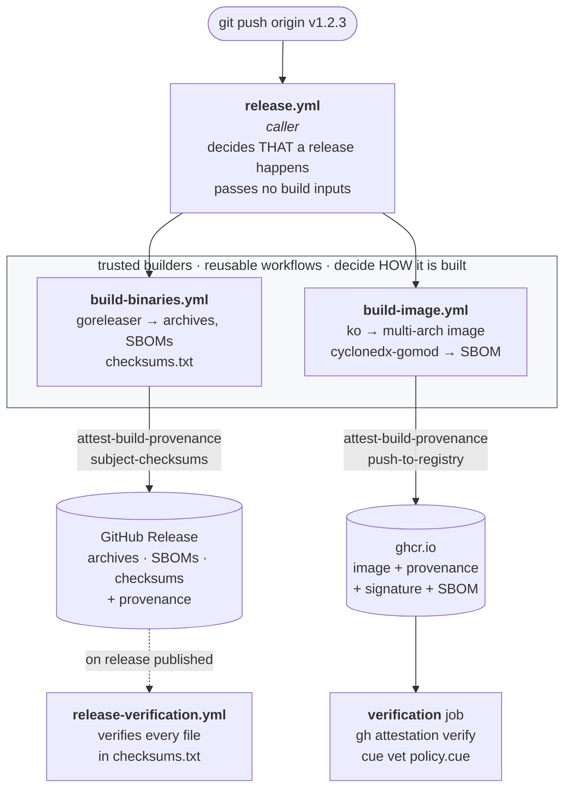
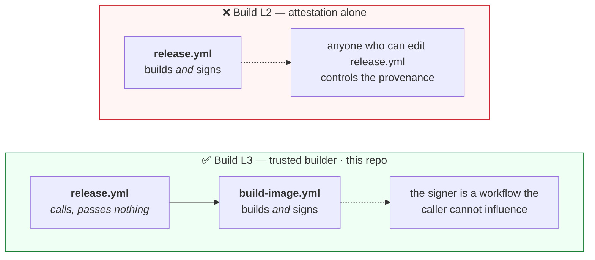

# PodSalsa GitHub Workflows

## Overview

Following workflows are implemented in the repository.
[SARIF](https://docs.github.com/en/code-security/code-scanning/integrating-with-code-scanning/sarif-support-for-code-scanning) is used to store the results for an analysis of code scanning tools in the Security tab of the repository.

| Workflow                                               | Jobs                            | Trigger                                                       | SARIF upload | Description                                                                                     |
| :----------------------------------------------------- | :------------------------------ | :------------------------------------------------------------ | :----------- | ----------------------------------------------------------------------------------------------- |
| [codeql.yml](./codeql.yml)                             | `analyze`                       | push/pr to `main`, cron: `00 13 * * 1`                        | yes          | Semantic code analysis                                                                          |
| [dependency-review.yml](./dependency-review.yml)       | `dependency-review`             | pr to `main`                                                  | -            | Check pull request for vulnerabilities in dependencies or invalid licenses are being introduced |
| [fossa.yml](./fossa.yml)                               | `analyze`                       | push/pr on `*`                                                | -            | FOSSA analysis                                                                                  |
| [golangci-lint.yml](./golangci-lint.yml)               | `lint`                          | push/pr on `*`                                                | -            | Lint Go Code                                                                                    |
| [gosec.yml](./gosec.yml)                               | `analyze`                       | push/pr on `*`                                                | -            | Inspects source code for security problems in Go code                                           |
| [osv-scan.yml](./osv-scan.yml)                         | `analyze`                       | push/pr to `main`, cron: `30 13 * * 1`                        | yes          | Scanning for vulnerabilites in dependencies                                                     |
| [release.yml](./release.yml)                           | see [release chapter](#release) | push tag `v*`                                                 | -            | Create release with go binaries and docker container                                            |
| [build-binaries.yml](./build-binaries.yml)             | `build`                         | called by `release.yml`                                       | -            | Trusted builder for the go archives (reusable workflow)                                         |
| [build-image.yml](./build-image.yml)                   | `build`                         | called by `release.yml`                                       | -            | Trusted builder for the container images (reusable workflow)                                    |
| [release-verification.yml](./release-verification.yml) | see [release chapter](#release) | release published                                             | -            | Verify assets of a new release                                                                  |
| [scorecard.yml](./scorecard.yml)                       | `analyze`                       | push to `main`, cron: `00 14 * * 1`, change branch protection | yes          | Create OpenSSF analysis and create project score                                                |

## CodeQL

Action: https://github.com/github/codeql-action

[CodeQL](https://codeql.github.com/) is a semantic code analysis engine that can find security vulnerabilities in codebases. The workflow displays security alerts in the repository's Security tab or in pull requests.

## Dependency Review

Action: https://github.com/actions/dependency-review-action

This action scans the dependency manifest files that change as part of a pull request, revealing known-vulnerable versions of the packages declared or updated in the PR. Pull requests that introduce known-vulnerable packages will be blocked from merging.
It also allows you to define a list of licenses that are allowed or disallowed in the project, and will check if the PR introduces a dependency with a disallowed license.
It also checks the OpenSSF scorecard for all dependencies and allows to warn if a dependency has a low score.

More information can be found in the [GitHub documentation](https://docs.github.com/en/code-security/supply-chain-security/understanding-your-software-supply-chain/about-dependency-review)

## FOSSA

Action: https://github.com/fossa-contrib/fossa-action

[FOSSA](https://fossa.com/) is a dependency analysis tool that scans the project for dependencies and checks for vulnerabilities and licenses. The workflow uploads the results to the FOSSA dashboard. The link to the dashboard is available in the README file by clicking on one of the FOSSA badges.
The `FOSSA_API_KEY` secret must be set for the Actions and for Dependabot!

 

## GolangCI-Lint

Action: https://github.com/golangci/golangci-lint-action

[GolangCI-Lint](https://golangci-lint.run/) is a fast Go linters runner. It runs linters in parallel, uses caching, and works on Linux, macOS, and Windows. The workflow runs the linters on the Go code in the repository.

## Gosec

Action: https://github.com/securego/gosec

[Gosec](https://securego.io/) is a security tool that performs static code analysis of Go code. The workflow scans the Go code in the repository for security issues.

## OSV-Scan

Action: https://github.com/google/osv-scanner-action

[OSV-Scan](https://osv.dev/) is a vulnerability database and triage infrastructure for open-source projects. The [OSV-Scanner](https://google.github.io/osv-scanner/) finds vulnerabilities in dependencies of an project and uploads the results to the Security tab of the repository.

## Release

Pushing a `v*` tag starts the whole pipeline:

The release workflow includes multiple jobs to create a release of the project. Following jobs are implemented:

| Job                                  | GitHub Action                                                                              | Description                                                                                                          |
| :----------------------------------- | :----------------------------------------------------------------------------------------- | :------------------------------------------------------------------------------------------------------------------- |
| `binaries`                           | [build-binaries.yml](./build-binaries.yml)                                                 | Trusted builder: creates the go archives & checksums file and signs their provenance                                 |
| `image`                              | [build-image.yml](./build-image.yml)                                                       | Trusted builder: creates the container images & SBOMs, signs the images and their provenance                         |
| `verification`                       | -                                                                                          | Verifying the provenance, signature and SBOM of the container image                                                  |
| `verification-with-gh-attestation`   | -                                                                                          | Verifying the provenance for all binary releases (only possible if release is published)                             |

### Trusted builders and SLSA Build Level 3

SLSA Build Level 3 requires that provenance is produced by a build platform whose instructions the caller cannot influence. GitHub Artifact Attestations give Level 2 out of the box; Level 3 additionally requires that the build runs in a reusable workflow that isolates it from the calling workflow.

This repository therefore splits the release into a *caller* and two *trusted builders*:

- [release.yml](./release.yml) decides **that** a release happens. It passes no build inputs.
- [build-binaries.yml](./build-binaries.yml) and [build-image.yml](./build-image.yml) decide **how** it is built, and sign their own provenance.

The consequence for verification is visible in the provenance itself — the two fields come from different OIDC claims:

| Provenance field | OIDC claim | Names |
| :--- | :--- | :--- |
| `runDetails.builder.id` | `job_workflow_ref` | the **trusted builder** that signed |
| `buildDefinition.externalParameters.workflow.path` | `workflow_ref` | the **caller** |

Verification pins the former, so provenance signed by any other workflow in the repository is rejected — including `release.yml` itself.

The identity is pinned with `gh attestation verify --cert-identity-regex` rather than the friendlier `--signer-workflow`, because the latter matches the signer identity by prefix and does not pin the tag. See the note in [SECURITY.md](./../../SECURITY.md#verify-provenance-of-release-artifacts).

### Go Release

This repository uses [goreleaser](https://goreleaser.com/) to create all the release artifacts. GoReleaser can build and release Go binaries for multiple platforms, create archives/container images/SBOMs and more. All the configuration for the release is stored in the file [.goreleaser.yml](./../../.goreleaser.yml).
Provenance is generated with [actions/attest-build-provenance](https://github.com/actions/attest-build-provenance) over the `checksums.txt` file. Because that file lists every released archive and SBOM, a single attestation covers all release artifacts (`*.tar.gz`, `*.zip`, `*.sbom.json`), each of which can be verified individually with `gh attestation verify` (see [Release Verification](./../../SECURITY.md#release-verification)).

### Container Release

The multi-arch container images are built using [ko](https://ko.build/) in the [publish-image](../actions/publish-image/action.yaml) action and uploaded to the GitHub Container Registry. The image provenance is generated with [actions/attest-build-provenance](https://github.com/actions/attest-build-provenance) and pushed to the registry as an OCI 1.1 referrer, so it travels alongside the image. The provenance can be verified using the `gh` or `cosign` tool (see [Release Verification](./../../SECURITY.md#release-verification)).

**Credits**: The [publish-image](../actions/publish-image/action.yaml) action is from [Kyverno](https://github.com/kyverno/kyverno).

### Container SBOM

[ko](https://ko.build/features/sboms/) only generates a "minimal" SBOM for the container images (see [comment in GitHub Issue](https://github.com/ko-build/ko/pull/587#issuecomment-1034926085)) and lacks some information (e.g. Licensing information or the `version` field which is set to `devel` instead of the actual version).

To generate a complete SBOM for the container images, the [cyclonedx-gomod](https://github.com/CycloneDX/cyclonedx-gomod) CLI is used instead, pinned in the [Makefile](./../../Makefile) and invoked through the `sbom-container` target.

The SBOMs of the container images are uploaded to a separate package registry (see [SBOM](./../../SECURITY.md#sbom) for more information).

## Scorecards

Action: https://github.com/ossf/scorecard-action

[Scorecards](https://github.com/ossf/scorecard) is a tool that provides a security score for open-source projects. The workflow runs the scorecard on the repository and uploads the results to the Security tab of the repository. There is also a report on the OpenSSF website, the link is available in the README file by clicking on the OpenSSF Scorecard badge.

