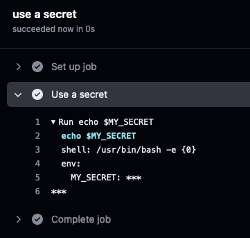

# Best practices & security considerations

This document outlines an overview of best practices for writing and maintaining GitHub Actions. For the full detailed security hardening Guide refer to the [GitHub Actions Security Hardening Guide](https://docs.github.com/en/actions/security-guides/security-hardening-for-github-actions).

## Using secrets

Always use secrets for sensitive data like API keys, passwords, and tokens. Never hardcode secrets in the workflow files. Secrets are encrypted and stored in GitHub, and they are never printed in the logs. However, secrets can be transformed in multiple ways and somehow exposed in the logs.

Documentation how to use secrets in GitHub Actions can be found [here](https://docs.github.com/en/actions/security-guides/using-secrets-in-github-actions).

Example of using a secret in a workflow:

```yaml
jobs:
  test-job:
    name: use a secret
    runs-on: ubuntu-latest
    steps:
    - name: Use a secret
      env:
        MY_SECRET: ${{ secrets.MY_SECRET }}
      run: echo $MY_SECRET
```



## Using CODEOWNERS file

The `CODEOWNERS` file defines individuals or teams that are responsible for code in a repository. The file is used to automatically request reviews from the code owners when a pull request changes any owned files. The syntax of the file is described [here](https://docs.github.com/en/repositories/managing-your-repositorys-settings-and-features/customizing-your-repository/about-code-owners).

## Prevent script injection

A GitHub Actions workflow can be triggered on specific events like push, pull request, new release and so on. Every workflow trigger provides a [Github context](https://docs.github.com/en/actions/learn-github-actions/contexts#github-context) that contains information about the event. This can be the branch name, username, user email, pull request title and body, etc. All this input should be treated as potentially untrusted data and make sure it doesn't flow into shell or API calls where it can be interpreted as code.

### Example with inline script

GitHub Actions support their own [expression syntax](https://docs.github.com/en/actions/learn-github-actions/contexts) witch can be used to access the context data. The following example shows how to access the commit message from the context and check if it follows a specific pattern.

```yaml
jobs:
  test:
    name: use a secret
    runs-on: ubuntu-latest
    env:
      MY_SECRET: ${{ secrets.MY_SECRET }}
    steps:
    - name: Check commit message
      run: |
        message="${{ github.event.head_commit.message }}"
        if [[ ! $message =~ ^.*:\ .*$ ]]; then
            echo "Bad commit message"
            exit 1
        fi
```

The problem with this approach is the `run` operation, which starts a temporary shell and executes the script. Before running the script, the GitHub context data (`${{ }}`) is evaluated and substituted with the resulting values which make it vulnerable to shell command injection. If we use a commit message like `docs: improve"; echo "${MY_SECRET}`, it will print the secret in the logs. Since GitHub secrets are not printed in the logs, we can use following commit message to print the secret over two lines: `docs: improve"; echo "${MY_SECRET:0:4}"; echo "${MY_SECRET:4:200}`.


### Mitigating script injection attacks

The recommended way is use an action instead of an inline script. There, the context value can be passed as an argument. 

```yaml
uses: fakeaction/checktitle@v3
with:
    title: ${{ github.event.pull_request.title }}
```

A simple workaround for the inline script is to use an intermediate environment variable. This way, the context value is not directly passed and evaluated in the shell.

```yaml
jobs:
  test:
    name: use a secret
    runs-on: ubuntu-latest
    env:
      MY_SECRET: ${{ secrets.MY_SECRET }}
    steps:
    - name: Check commit message (mitigate shell injection)
      env:
        MESSAGE: ${{ github.event.head_commit.message }}
      run: |
        if [[ ! $MESSAGE =~ ^.*:\ .*$ ]]; then
            echo "Bad commit message"
            exit 1
        fi
```