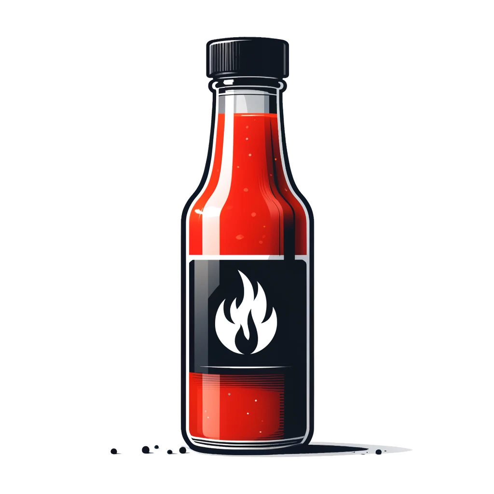

# PodSalsa

    

---

PodSalsa is a simple web application that only displays information about the release version of the application, the Git commit and the build date.
The goal of this project is to provide a simple example of a Go application on GitHub with GitHub Actions for building and releasing the application in a secure way. The focus is on providing a summary/documentation of GitHub Actions best practices, code scanning workflows, vulnerability scanning, and techniques for releasing secure software to improve the security of the software supply chain.

## Work in Progress 🏗️

- [x] Document Workflows
- [x] OpenSSF best practices
- [x] Resolve "Code Scanning" alerts (as far as possible)
- [x] Document GitHub Actions Best Practices
- [x] Implement the release workflow for sbom, docker images, code scanning, and signing
  - [x] Create the go binaries for multiple platforms
  - [x] Go lint and security scans
  - [x] Generates a Software Bill of Materials (SBOM)
  - [x] Create multi-arch docker images
  - [x] Signs the sbom, the binaries checksum and the container images with Cosign and GitHub OIDC
  - [x] Upload the sbom, binaires, checksums to GitHub Releases
  - [x] Pushes the container images to GitHub Container Registry and Harbor registry
- [ ] Document Security Policy (Verifying the release artifacts)
- [ ] Document Release Workflow

## Documentation

All the used workflows and security best practices are documented in the following files:

- [PodSalsa GitHub Workflows](./.github/workflows/README.md)
- [Verifying the release artifacts](./SECURITY.md#release-verification)
- [GitHub Actions Best Practices](./docs/best-practices.md)

More documentation will be added in the future.
