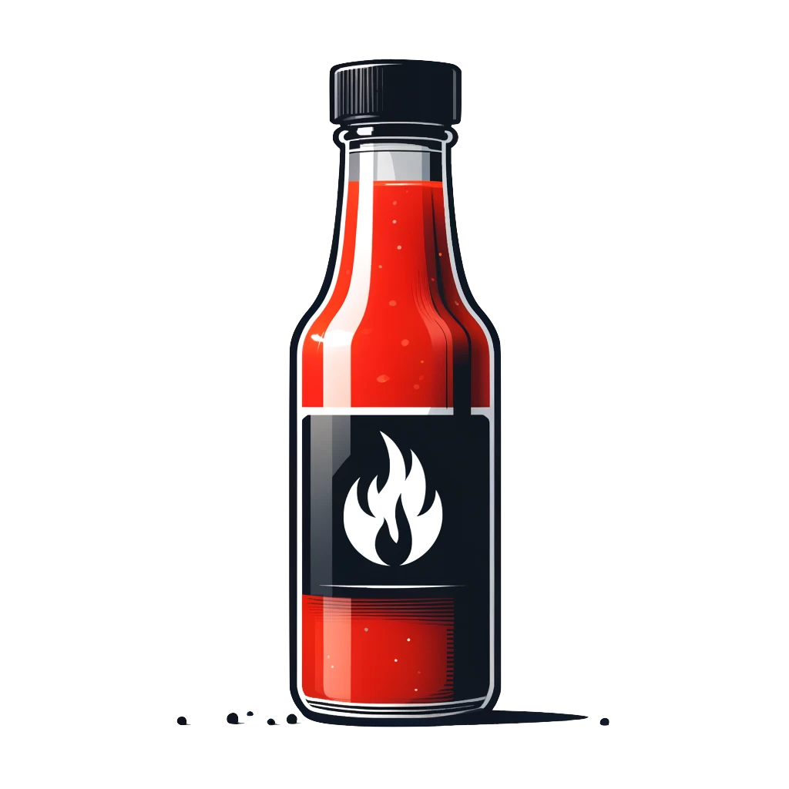

# PodSalsa

    

---

PodSalsa is a simple web application that only displays information about the release version of the application, the Git commit, and the build date.
The goal of this project is to provide a simple example of a Go application on GitHub with GitHub Actions for building and releasing the application in a secure way. The focus is on providing a summary/documentation of GitHub Actions best practices, code scanning workflows, vulnerability scanning, and techniques for releasing secure software to improve the security of the software supply chain. This project serves as a starting point for developers interested in supply chain security, artifact provenance, and verification.

## Release

Each release of the application includes Go-binary archives, checksums file, SBOMs and container images. 

The release workflow creates provenance for its builds using the [SLSA standard](https://slsa.dev), which conforms to the [Level 3 specification](https://slsa.dev/spec/v1.0/levels#build-l3). Each artifact can be verified using the `slsa-verifier` or `cosign` tool.

| Artifact           | Description                                        | Verification                                                                                                                                   |
| ------------------ | -------------------------------------------------- | ---------------------------------------------------------------------------------------------------------------------------------------------- |
| Go-binary archives | Multi-architecture and platform Go-binary archives | [SLSA-Provenance](./SECURITY.md#verify-provenance-of-release-artifacts)                                                                        |
| Checksums file     | Checksums file of the Go-binary archives           | [Cosign signature](./SECURITY.md#verify-signature-of-checksum-file)                                                                            |
| SBOMs              | SBOMs of the Go-binary archives                    | [SLSA-Provenance](./SECURITY.md#go-binary-archives)                                                                                            |
| Container images   | Multi-architecture container images                | [SLSA-Provenance](./SECURITY.md#verify-provenance-of-container-images) & [Cosign Signature](./SECURITY.md#verify-signature-of-container-image) |
| SBOMs              | SBOMs of the container images                      | [SLSA-Provenance](./SECURITY.md#container-images)                                                                                              |

## Documentation

> [!NOTE]
> All the used workflows, security best practices and more related themes (e.g. component analysis, enforcement on Kubernetes) are documented in this repository.
> Have a look at the [documentation](./docs/) for more information.

## Use Cases

You can use this project as a reference for securely building and releasing Go applications on GitHub with SLSA Build Level 3 provenance. Feel free to fork this repository and adapt it to your needs, use the workflows and security best practices in your projects.
