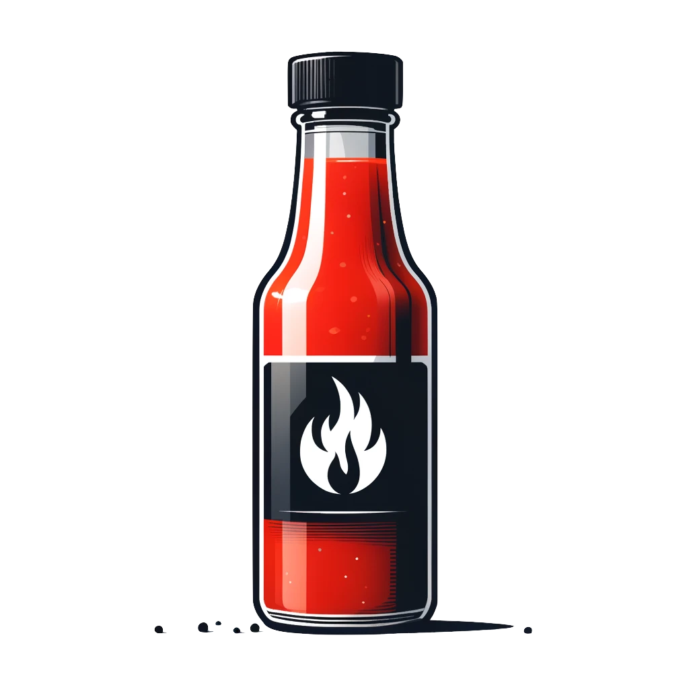
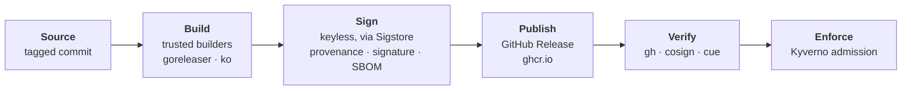

# PodSalsa

[](https://github.com/janfuhrer/podsalsa/blob/main/LICENSE)
[](https://securityscorecards.dev/viewer/?uri=github.com/janfuhrer/podsalsa)
[](https://www.bestpractices.dev/projects/8791)
[](https://github.com/janfuhrer/podsalsa/releases)
[](https://github.com/janfuhrer/podsalsa/blob/main/go.mod)
[](https://app.fossa.com/projects/custom%2B44203%2Fgithub.com%2Fjanfuhrer%2Fpodsalsa?ref=badge_shield&issueType=license)
[](https://app.fossa.com/projects/custom%2B44203%2Fgithub.com%2Fjanfuhrer%2Fpodsalsa?ref=badge_shield&issueType=security)
[](https://slsa.dev)

<p align="center">
    
</p>

---

**PodSalsa is a worked example of releasing a Go application securely on GitHub.**

The application itself is deliberately trivial — a small web service that displays its own
version, Git commit and build date. The interesting part is everything around it: how the
binaries and container images are built, what is signed, what provenance is produced, and how
anyone can verify all of it independently.

Releases carry [SLSA](https://slsa.dev) **Build Level 3** provenance. If you are here for one
thing, it is probably [how that is wired](#how-it-works) or
[how to verify it](#verify-a-release).

## How it works

Every release travels the same path, and every step leaves something a consumer can check:


```mermaid
flowchart LR
    src["<b>Source</b><br/>tagged commit"]
    build["<b>Build</b><br/>trusted builders<br/>goreleaser · ko"]
    sign["<b>Sign</b><br/>keyless, via Sigstore<br/>provenance · signature · SBOM"]
    pub["<b>Publish</b><br/>GitHub Release<br/>ghcr.io"]
    ver["<b>Verify</b><br/>gh · cosign · cue"]
    enf["<b>Enforce</b><br/>Kyverno admission"]

    src --> build --> sign --> pub --> ver --> enf
```

The build and the signing happen inside **trusted builders** — reusable workflows that the
calling workflow cannot influence. That isolation is what raises the provenance from Build
Level 2 to Level 3, and it is the property verification actually pins.
[Read how the pipeline is put together →](.github/workflows/README.md#release)

Alongside the release pipeline, the repository runs code scanning, dependency review and
vulnerability scanning on every change — see [the workflow overview](.github/workflows/README.md).

## Verify a release

Everything published is verifiable with the [GitHub CLI](https://cli.github.com/) and
[cosign](https://github.com/sigstore/cosign). To check a released binary:

```bash
export VERSION=$(curl -s "https://api.github.com/repos/janfuhrer/podsalsa/releases/latest" | jq -r '.tag_name')
export ARTIFACT=podsalsa_${VERSION}_darwin_amd64.tar.gz
curl -L -O https://github.com/janfuhrer/podsalsa/releases/download/$VERSION/$ARTIFACT

gh attestation verify $ARTIFACT \
  --repo janfuhrer/podsalsa \
  --cert-identity-regex '^https://github\.com/janfuhrer/podsalsa/\.github/workflows/build-binaries\.yml@refs/tags/v[0-9]+\.[0-9]+\.[0-9]+(-rc\.[0-9]+)?$' \
  --source-ref refs/tags/$VERSION \
  --deny-self-hosted-runners
```

**[Full verification guide →](SECURITY.md#release-verification)** covering container images,
signatures, SBOMs and policy validation.

### What every release contains

| Artifact | Description | Verification |
| :--- | :--- | :--- |
| Go-binary archives | Multi-architecture and platform archives | [SLSA provenance](SECURITY.md#verify-release-artifacts) |
| Container images | Multi-architecture images on `ghcr.io` | [SLSA provenance](SECURITY.md#verify-container-images) & [cosign signature](SECURITY.md#verify-the-image-signature) |
| SBOMs | CycloneDX, for both archives and images | [SLSA provenance](SECURITY.md#sboms) & [cosign attestation](SECURITY.md#sboms) |
| Checksums file | SHA-256 of the archives | [cosign signature](SECURITY.md#verify-the-checksums-file) |

## Run it

```bash
# container
docker run --rm -p 8080:8080 ghcr.io/janfuhrer/podsalsa:latest

# or with compose
docker compose up
```

The service listens on `:8080` and serves `/` and `/health`. Configuration is read from flags
or `PODSALSA_`-prefixed environment variables (for example `PODSALSA_LEVEL=debug`).
A Kubernetes manifest is in [kubernetes/](kubernetes/), and building from source is
`make go-build`.

## Documentation

Start at the **[documentation index](docs/)**, which is organised around how it is built, how
that is proven, and how you check it. The most-used entry points:

| | |
| :--- | :--- |
| [Release verification](SECURITY.md#release-verification) | Verify binaries, images, signatures and SBOMs |
| [GitHub workflows](.github/workflows/README.md) | Every workflow, and how the release pipeline fits together |
| [Trusted builders & SLSA L3](.github/workflows/README.md#trusted-builders-and-slsa-build-level-3) | Why the release is split into a caller and two builders |
| [GitHub Actions best practices](docs/gh-actions/) | Secrets, permissions, script injection, pinning |
| [Sigstore & keyless signing](docs/slsa/sigstore/) | What happens when something is signed |
| [Kubernetes enforcement](docs/slsa/enforcement-kubernetes/) | Blocking unverified images with Kyverno |
| [Additional information](docs/additional/) | Component analysis with Dependency-Track and GUAC |
| [Archive](archive/) | Superseded approaches, including [verification of releases ≤ v0.9.x](archive/verification-legacy.md) |

## Use cases

Use this repository as a reference for securely building and releasing Go applications on
GitHub with SLSA Build Level 3 provenance. Fork it, adapt the workflows, and reuse the
security practices in your own projects.

If you are adapting the release pipeline, note that the trusted-builder split and the
certificate identities in [policy.cue](policy.cue), [SECURITY.md](SECURITY.md) and the
verification workflows all reference each other — [CLAUDE.md](CLAUDE.md) lists what has to
change together.
