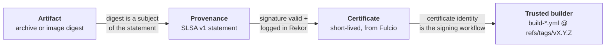

# Security Policy

## Reporting Security Issues

The contributor and community take security bugs in PodSalsa seriously. We appreciate your efforts to responsibly disclose your findings, and will make every effort to acknowledge your contributions.

To report a security issue, please use the GitHub Security Advisory ["Report a Vulnerability"](https://github.com/janfuhrer/podsalsa/security/advisories/new) tab.

The contributor will send a response indicating the next steps in handling your report. After the initial reply to your report, the security team will keep you informed of the progress towards a fix and full announcement, and may ask for additional information or guidance.

## Release verification

Every release is accompanied by [SLSA](https://slsa.dev) build provenance that conforms to the [Level 3 specification](https://slsa.dev/spec/v1.2/build-track-basics#build-l3). The provenance is generated with [GitHub Artifact Attestations](https://docs.github.com/en/actions/concepts/security/artifact-attestations) and signed by [Cosign](https://github.com/sigstore/cosign) using [keyless signing](https://docs.sigstore.dev/cosign/verifying/verify/#keyless-verification-using-openid-connect).

### What verification proves

Verifying an artifact walks a chain from the bytes you downloaded back to the workflow that built them:



The last link is the one that matters most. Provenance is only as trustworthy as the builder that signed it, so verification pins the certificate identity to a **trusted builder** — a reusable workflow that runs the build and signs its own provenance, and that the calling workflow cannot influence. That isolation is what makes these releases Build Level 3 rather than Level 2; see [the workflow documentation](.github/workflows/README.md#trusted-builders-and-slsa-build-level-3) for how it is wired.

| Artifact | Built and signed by | Verify with |
| :--- | :--- | :--- |
| Go-binary archives, their SBOMs | `build-binaries.yml` | [`gh attestation verify`](#verify-release-artifacts) |
| `checksums.txt` | `build-binaries.yml` | [`cosign verify-blob`](#verify-the-checksums-file) |
| Container images | `build-image.yml` | [`gh attestation verify`](#verify-container-images) |
| Container image signature, SBOM | `build-image.yml` | [`cosign verify`](#verify-the-image-signature) |

> [!NOTE]
> These instructions apply to **v0.10.0 and later**. Releases up to v0.9.x were built with the deprecated `slsa-github-generator` and are verified with `slsa-verifier` instead — their provenance is still valid, see [archive/verification-legacy.md](archive/verification-legacy.md).

### Prerequisites

You will need the [GitHub CLI](https://cli.github.com/) (`gh`, v2.49.0 or newer), [cosign](https://github.com/sigstore/cosign), [crane](https://github.com/google/go-containerregistry/blob/main/cmd/crane/README.md) and, to validate provenance against the CUE policy, [cue](https://cuelang.org/). See [prerequisites](docs/slsa/prerequisites-verification.md) for installation instructions.

All commands below expect `VERSION` to be set:

```bash
export VERSION=$(curl -s "https://api.github.com/repos/janfuhrer/podsalsa/releases/latest" | jq -r '.tag_name')
```

### Verify release artifacts

Every file listed in `checksums.txt` — the archives and their SBOMs — is a subject of the same provenance attestation, so the same command verifies any of them:

```bash
export ARTIFACT=podsalsa_${VERSION}_darwin_amd64.tar.gz
curl -L -O https://github.com/janfuhrer/podsalsa/releases/download/$VERSION/$ARTIFACT

gh attestation verify $ARTIFACT \
  --repo janfuhrer/podsalsa \
  --cert-identity-regex '^https://github\.com/janfuhrer/podsalsa/\.github/workflows/build-binaries\.yml@refs/tags/v[0-9]+\.[0-9]+\.[0-9]+(-rc\.[0-9]+)?$' \
  --source-ref refs/tags/$VERSION \
  --deny-self-hosted-runners
```

The output should end with `✓ Verification succeeded!`.

Each flag carries weight: `--cert-identity-regex` pins the trusted builder that signed, `--source-ref` pins the released tag, and `--deny-self-hosted-runners` rejects provenance produced outside GitHub-hosted infrastructure.

> [!NOTE]
> `gh` also offers the more readable `--signer-workflow janfuhrer/podsalsa/.github/workflows/build-binaries.yml`. We use the anchored `--cert-identity-regex` instead, because `--signer-workflow` matches **by prefix**: it would also accept a workflow named `build-binaries.yml.bak`, and it does not pin the tag. The two cannot be combined — `--cert-identity-regex` takes precedence and `--signer-workflow` is silently ignored.

To read the provenance rather than just check it:

```bash
gh attestation verify $ARTIFACT --repo janfuhrer/podsalsa \
  --cert-identity-regex '^https://github\.com/janfuhrer/podsalsa/\.github/workflows/build-binaries\.yml@refs/tags/v[0-9]+\.[0-9]+\.[0-9]+(-rc\.[0-9]+)?$' \
  --format json --jq '.[0].verificationResult.statement' | jq
```

> [!IMPORTANT]
> Only the certificate and the verified timestamps cannot be influenced by the workflow that produced the attestation. Treat the `predicate` contents as claims that are exactly as trustworthy as the builder that signed them.

### Verify container images

The provenance is pushed to the registry as an OCI 1.1 referrer, so it travels with the image. Always verify by digest — a tag is not immutable.

```bash
IMAGE=ghcr.io/janfuhrer/podsalsa:$VERSION
IMAGE="${IMAGE}@"$(crane digest "${IMAGE}")

gh attestation verify oci://$IMAGE \
  --repo janfuhrer/podsalsa \
  --cert-identity-regex '^https://github\.com/janfuhrer/podsalsa/\.github/workflows/build-image\.yml@refs/tags/v[0-9]+\.[0-9]+\.[0-9]+(-rc\.[0-9]+)?$' \
  --source-ref refs/tags/$VERSION \
  --deny-self-hosted-runners
```

Add `--bundle-from-oci` to read the attestation from the registry instead of the GitHub API.

**Validate the provenance contents against a policy**

The command above proves *who* signed. [policy.cue](policy.cue) expresses the complementary question — whether the build it describes is one you are willing to trust — by pinning the trusted builder, source repository, release tag pattern, entrypoint workflow, and that the build ran on a GitHub-hosted runner.

```bash
curl -L -O https://raw.githubusercontent.com/janfuhrer/podsalsa/main/policy.cue

gh attestation verify oci://$IMAGE \
  --repo janfuhrer/podsalsa \
  --cert-identity-regex '^https://github\.com/janfuhrer/podsalsa/\.github/workflows/build-image\.yml@refs/tags/v[0-9]+\.[0-9]+\.[0-9]+(-rc\.[0-9]+)?$' \
  --format json --jq '.[0].verificationResult.statement' > statement.json

cue vet policy.cue statement.json && echo "provenance matches policy"
```

`cue vet` is silent and exits `0` on success. On a mismatch it names the offending field:

```
predicate.runDetails.builder.id: invalid value
  "https://github.com/janfuhrer/podsalsa/.github/workflows/release.yml@refs/tags/v0.10.0"
  (out of bound ...build-image\.yml@refs/tags/...)
```

The release workflow enforces this same policy, so a release cannot be published with provenance that fails it.

### Verify the image signature

The images are additionally signed with cosign, stored as an OCI 1.1 referrer. Only the multi-arch image is signed, not the individual platform images.

```bash
cosign verify \
  --new-bundle-format \
  --certificate-oidc-issuer https://token.actions.githubusercontent.com \
  --certificate-identity-regexp '^https://github.com/janfuhrer/podsalsa/.github/workflows/build-image.yml@refs/tags/v[0-9]+.[0-9]+.[0-9]+(-rc.[0-9]+)?$' \
  $IMAGE | jq
```

> [!IMPORTANT]
> Provenance verification is the stronger guarantee: it covers the whole build process, not just the final image, and the provenance already binds the image digest. If you verify provenance, the image signature is not strictly necessary.

### Verify the checksums file

The provenance already covers artifact integrity, so `checksums.txt` is mainly useful if you want to rely on cosign alone.

```bash
curl -L -O https://github.com/janfuhrer/podsalsa/releases/download/$VERSION/checksums.txt
curl -L -O https://github.com/janfuhrer/podsalsa/releases/download/$VERSION/checksums.txt.sigstore.json

cosign verify-blob \
  --bundle checksums.txt.sigstore.json \
  --certificate-identity-regexp '^https://github.com/janfuhrer/podsalsa/.github/workflows/build-binaries.yml@refs/tags/v[0-9]+.[0-9]+.[0-9]+(-rc.[0-9]+)?$' \
  --certificate-oidc-issuer https://token.actions.githubusercontent.com \
  checksums.txt
```

The output should be `Verified OK`.

### SBOMs

SBOMs are published in CycloneDX JSON format.

**Go binary archives** — provided as `*.tar.gz.sbom.json` release assets. They are listed in `checksums.txt`, so they are covered by the same provenance attestation as the archives and verified the [same way](#verify-release-artifacts).

**Container images** — attested with cosign and stored as an OCI 1.1 referrer. Only the multi-arch image carries an SBOM.

```bash
curl -L -O https://raw.githubusercontent.com/janfuhrer/podsalsa/main/policy-sbom.cue

cosign verify-attestation \
  --new-bundle-format \
  --type cyclonedx \
  --certificate-oidc-issuer https://token.actions.githubusercontent.com \
  --certificate-identity-regexp '^https://github.com/janfuhrer/podsalsa/.github/workflows/build-image.yml@refs/tags/v[0-9]+.[0-9]+.[0-9]+(-rc.[0-9]+)?$' \
  --policy policy-sbom.cue \
  $IMAGE | jq -r '.payload' | base64 -d | jq
```

Append `| jq -r '.predicate' > sbom.json` to save the SBOM itself.

### Further reading

- [How the keyless signing works](docs/slsa/sigstore/) — Sigstore, Fulcio and Rekor
- [Querying the Rekor transparency log](docs/slsa/sigstore/rekor.md)
- [Enforcing verification on Kubernetes](docs/slsa/enforcement-kubernetes/) — with Kyverno
- [Legacy verification (≤ v0.9.x)](archive/verification-legacy.md)
