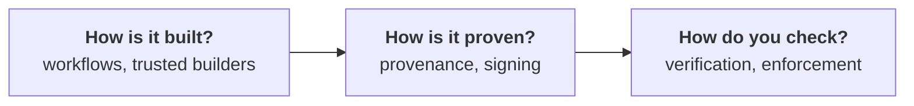

# Documentation

PodSalsa is a reference for building and releasing a Go application on GitHub with
**SLSA Build Level 3** provenance. The documentation is organised around three questions.

## How is it built?

| Documentation | Summary |
| :--- | :--- |
| [PodSalsa GitHub Workflows](../.github/workflows/README.md) | Every workflow in the repository, and how the release pipeline fits together |
| [Trusted builders and SLSA Build L3](../.github/workflows/README.md#trusted-builders-and-slsa-build-level-3) | Why the release is split into a caller and two trusted builders |
| [GitHub Actions best practices](./gh-actions/) | Secrets, permissions, script injection, pinning, Scorecard, Allstar |

## How is it proven?

| Documentation | Summary |
| :--- | :--- |
| [Sigstore](./slsa/sigstore/) | How keyless signing works with Fulcio, Rekor and OIDC |
| [Rekor transparency log](./slsa/sigstore/rekor.md) | Querying the log and reading the signing certificate |

## How do you check?

| Documentation | Summary |
| :--- | :--- |
| [Release verification](../SECURITY.md#release-verification) | Verify every released artifact with `gh attestation verify` and `cosign` |
| [Prerequisites](./slsa/prerequisites-verification.md) | Installing `gh`, `cosign`, `crane`, `cue` |
| [Enforcement on Kubernetes](./slsa/enforcement-kubernetes/) | Blocking unverified images with Kyverno on a local kind cluster |
| [policy.cue](../policy.cue) | The CUE policy the provenance contents must satisfy |

## Also here

- **[Additional information](./additional/)** — supplementary material that is not part of the
  release pipeline, such as component analysis with Dependency-Track and GUAC.
- **[Archive](../archive/)** — superseded approaches kept for reference, including
  [verification of releases up to v0.9.x](../archive/verification-legacy.md).
