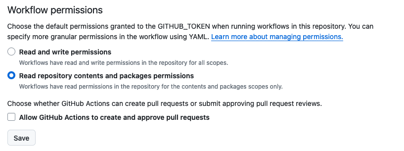
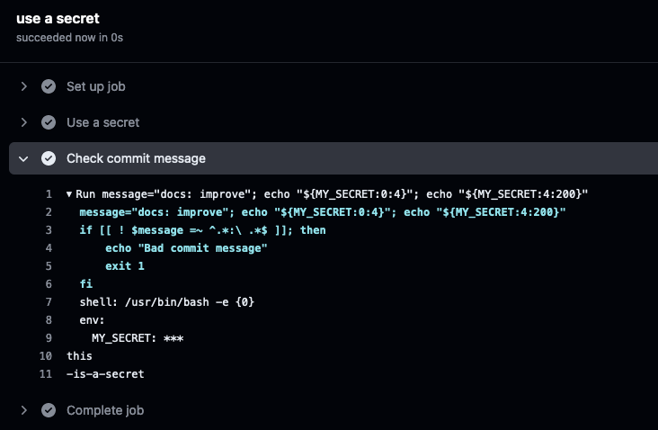
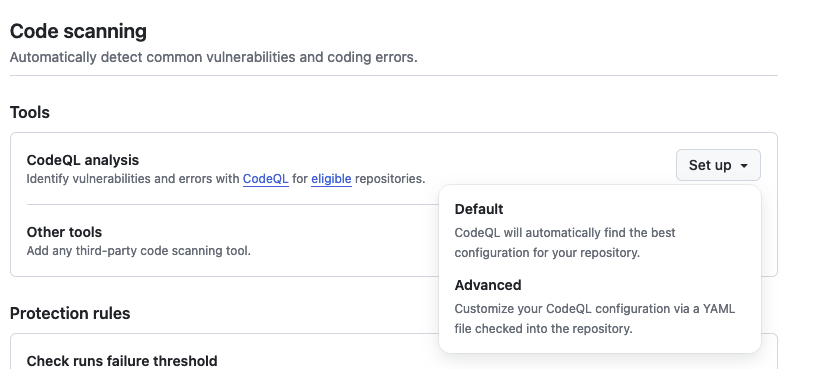
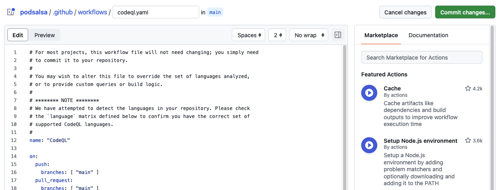
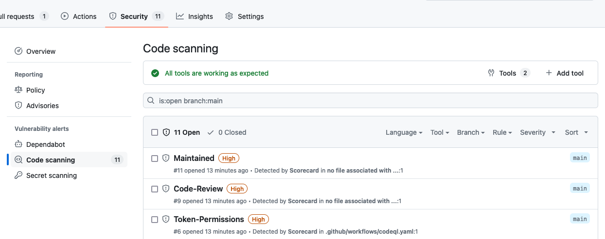

# Best practices & security considerations

This document provides an overview of best practices for writing and maintaining GitHub Actions. For the full detailed security hardening guide, see the [GitHub Actions Security Hardening Guide](https://docs.github.com/en/actions/security-guides/security-hardening-for-github-actions).

## Secrets

### Using secrets

Always use secrets for sensitive data such as API keys, passwords and tokens. Never hardcode secrets into workflow files. Secrets are encrypted and stored in GitHub, and are never printed in the logs. However, secrets can be transformed in various ways and somehow exposed in the logs (see the example in chapter [Example with inline script](#example-of-a-script-injection-attack-with-inline-script)).

Documentation on how to use secrets in GitHub Actions can be found [here](https://docs.github.com/en/actions/security-guides/using-secrets-in-github-actions).

Example of using a secret in a workflow:

```yaml
jobs:
  test-job:
    name: use a secret
    runs-on: ubuntu-latest
    steps:
    - name: Use a secret
      env:
        MY_SECRET: ${{ secrets.MY_SECRET }}
      run: echo $MY_SECRET
```


### Secret scanning

Secret scanning alerts is available for free on all public repositories on GitHub. It can be enabled in the repository settings under `Code security and analysis/Secret scanning`. When enabled, GitHub scans the repository for known secret patterns and alerts the repository owner via email if any secrets are found and create an alert in the repository's security tab. Additionally, a push protection can be enabled to prevent the push of secrets to the repository.

## Permissions & responsibilities

### GITHUB_TOKEN

The GitHub Actions runner automatically receives the `GITHUB_TOKEN` with permissions limited to the repository containing the workflow. The token expires after the job has finished. The permissions can be set per action on a global level and/or on a job level. To prevent the token from being exfiltrated and used maliciously, there are some best practices to follow:

**Default workflow permissions**

You can choose the default permissions granted to the `GITHUB_TOKEN` [at the repository level](https://docs.github.com/en/repositories/managing-your-repositorys-settings-and-features/enabling-features-for-your-repository/managing-github-actions-settings-for-a-repository#setting-the-permissions-of-the-github_token-for-your-repository). Go to the repository settings, then `Actions/General' and `Workflow permissions'. Here you can set the default permissions to "Read repository contents and packages permissions" and dissallow GitHub Actions to create and approve pull requests.



**Set permissions**

An overview of the permissions that can be set for the `GITHUB_TOKEN` can be found [here](https://docs.github.com/en/actions/using-jobs/assigning-permissions-to-jobs). To follow the principle of least privilege, you should only grant the permissions needed to run the job on a per-job basis. An example of setting permissions for a job only:

```yaml
# global permissions for every job
# disable all permissions with "{}"
permissions: {}

jobs:
  job_name:
    # job specific permissions
    permissions:
      security-events: write
      packages: read
    ...
```

### `pull_request` vs `pull_request_target`

The GitHub workflows can be triggered by various events, such as `push`, `pull_request`, `release`, etc. A workflow triggered by `pull_request` has access to the secrets of the repository and can make changes to the repository (if the appropriate write permissions are set). This is only true for pull requests made from the same repository. 

If a person has forked the repository and now creates a pull request in the original repository, the `pull_request` trigger will not be allowed to write to the repository or have access to the repository's secrets.

There is another event called `pull_request_target` which allows the workflow to run with the permissions of the target repository. This means that the workflow can write to the repository and access the secrets. This event should be used with caution, as it can be a security risk. Any automated processing of PRs from an external fork is potentially dangerous, and such PRs should be treated as untrusted input. A malicious actor could create a PR that triggers a workflow that exfiltrates secrets from the build system (e.g. by creating a new workflow or adding new test cases that send the secrets to a remote server).

In general it is recommended to use the `pull_request` event for workflows that don't require write access to the repository, and to avoid using `pull_request_target`.

There is a [blog post from GitHub](https://securitylab.github.com/research/github-actions-preventing-pwn-requests/) that explains the risks of using `pull_request_target` and how to use it safely if necessary.

### Checkout action

The [Checkout](https://github.com/actions/checkout) action is used to check out the repository code, which is necessary for most workflows. The action has a parameter `persist-credentials` which is set to `true` by default. This can be useful if a subsequent action needs to run authenticated git commands. However, this can be a security risk as the credentials are stored in the runner's workspace and can be accessed by other actions. It is recommended to set `persist-credentials` to `false` to prevent the credentials from being stored.

```yaml
jobs:
  dependency-review:
    steps:
      - id: checkout
        uses: actions/checkout@9bb56186c3b09b4f86b1c65136769dd318469633
        with:
          persist-credentials: false
```

### Using CODEOWNERS file

The `CODEOWNERS` file defines the individuals or teams responsible for the code in a repository. The file is used to automatically request reviews from the code owners when a pull request changes one of their files. The syntax of the file is described [here](https://docs.github.com/en/repositories/managing-your-repositorys-settings-and-features/customizing-your-repository/about-code-owners).

### Configure private vulnerability reporting

To provide a secure way of reporting vulnerabilities, you can enable private vulnerability reporting. This allows security researchers to report vulnerabilities privately to the maintainers of the repository without disclosing them to the public.

Private vulnerability reporting can be enabled in the repository settings. (see [GitHub documentation](https://docs.github.com/en/code-security/security-advisories/working-with-repository-security-advisories/configuring-private-vulnerability-reporting-for-a-repository#enabling-or-disabling-private-vulnerability-reporting-for-a-repository))

## GitHub Action Best Practices

### Prevent script injection

A GitHub Actions workflow can be triggered by specific events such as push, pull request, new release, and so on. Each workflow trigger provides a [GitHub context](https://docs.github.com/en/actions/learn-github-actions/contexts#github-context) which contains information about the event. This can be the branch name, username, user email, pull request title and body, etc. All this input should be treated as potentially untrusted data, and make sure it doesn't flow into shell or API calls where it can be interpreted as code.

#### Example of a script injection attack with inline script

GitHub Actions support their own [expression syntax](https://docs.github.com/en/actions/learn-github-actions/contexts), which can be used to access the context data. The following example shows how to access the commit message from the context and check if it follows a certain pattern.

```yaml
jobs:
  test:
    name: use a secret
    runs-on: ubuntu-latest
    env:
      MY_SECRET: ${{ secrets.MY_SECRET }}
    steps:
    - name: Check commit message
      run: |
        message="${{ github.event.head_commit.message }}"
        if [[ ! $message =~ ^.*:\ .*$ ]]; then
            echo "Bad commit message"
            exit 1
        fi
```

The problem with this approach is the `run` operation, which starts a temporary shell and executes the script. Before running the script, the GitHub context data (`${{ }}`) is parsed and replaced with the resulting values, making it vulnerable to shell command injection. If we use a commit message like `docs: improve"; echo "${MY_SECRET}`, the secret will be printed in the logs. Since GitHub secrets are not printed in the logs, we can use the following commit message to print the secret over two lines: `docs: improve"; echo "${MY_SECRET:0:4}"; echo "${MY_SECRET:4:200}`.



The value of the `MY_SECRET` secret will be printed in the logs (line 10-11)!

See the [bad-workflow](./examples/bad-workflow.yaml) for the full example.

### Mitigating script injection attacks

The recommended way is to use an action instead of an inline script. There, the context value can be passed as an argument. 

```yaml
uses: fakeaction/checktitle@v3
with:
    title: ${{ github.event.pull_request.title }}
```

A simple workaround for the inline script is to use an intermediate environment variable. This way, the context value is not directly passed and evaluated directl in the shell.

```yaml
jobs:
  test:
    name: use a secret
    runs-on: ubuntu-latest
    env:
      MY_SECRET: ${{ secrets.MY_SECRET }}
    steps:
    - name: Check commit message (mitigate shell injection)
      env:
        MESSAGE: ${{ github.event.head_commit.message }}
      run: |
        if [[ ! $MESSAGE =~ ^.*:\ .*$ ]]; then
            echo "Bad commit message"
            exit 1
        fi
```


## Additional Workflows

### Using third-party actions

Third party actions can be a significant security risk. A job may have access to repository secrets, may have access to a directory shared by other jobs, or may be able to use the `GITHUB_TOKEN` to write to the repository. Always check the source code of the action and the permissions it requires. It is recommended to **pin actions to a full-length commit SHA** rather than just a tag. In the GitHub Marketplace, you can see a "verified creator" badge, which indicates that the action was written by a team whose identity has been verified by GitHub.

You can use Dependabot to keep your actions up to date. Dependabot will automatically create pull requests to update your actions to the latest version.

### Using Dependabot

Dependabot is a tool that automatically creates pull requests to update dependencies in the repository. It can be used to keep all actions up-to-date and ensure that the latest security patches are applied.

The following features are available:

- **Dependabot alerts**: Dependabot alerts notify you about vulnerabilities in the dependencies. It creates an alert in the repository's security tab and in the dependency graph.
- **Dependabot security updates**: Triggered by Dependabot alerts, Dependabot security updates create pull requests to update the dependencies to a secure version.
- **Dependabot version updates**: Scheduled updates to keep dependencies up to date, is configurable in the `dependabot.yml` file.

**Secrets**

When a Dependabot event triggers a workflow, the only secrets available to the workflow are Dependabot secrets. GitHub Actions secrets are not available. Therefore, any secrets used by a workflow triggered by Dependabot events must be stored as Dependabot secrets.

**Configuration**

Dependabot can be enabled in the repository settings under `Code security and analysis/Dependabot`. 

The scheduled updates can be configured in the `dependabot.yml` file. All configuration options can be found [here](https://docs.github.com/en/code-security/dependabot/dependabot-version-updates/configuration-options-for-the-dependabot.yml-file).

ℹ️ See the [dependabot.yml](../.github/dependabot.yml) in this repository for an example of how to configure Dependabot version updates for GitHub Actions, docker and gomod.

### Using code scanning workflows 

To automatically scan your code for potential vulnerabilities, it's recommended that you use code scanning workflows. You can use [CodeQL](https://github.com/github/codeql) from GitHub or other third-party tools. CodeQL is an analysis engine that allows you to write queries to find vulnerabilities in your code. You can use the standard CodeQL queries written by GitHub researchers and community members, or write your own queries.

**Using CodeQL**

To enable CodeQL scanning, you need to add a workflow file to your repository. You can easily create the workflow in your repository settings.

Go to the `Code security and analysis` tab in the repository settings and click 'Set up' in the `Code scanning` section.



If you choose `Advanced`, you can edit the workflow file and customize it to your needs.



After committing the workflow file, the code scanning will start automatically. You can see the results in the `Code scanning alerts` tab.

ℹ️ See the [CodeQL Workflow Example](../.github/workflows/codeql.yml) in this repository.

## OpenSSF Scorecards

The [OpenSSF Scorecards](https://github.com/ossf/scorecard) helps source maintainers improve their security best practices by providing checks related to software security and assigning a score for each check and the overall project. The scorecard can be integrated into a GitHub Actions workflow. The goal is to automate analysis and trust decisions about the security posture of open source projects.

After activating the scorecard workflow, the results are uploaded to the repository's security tab. The results are in the [SARIF](https://docs.github.com/en/code-security/code-scanning/integrating-with-code-scanning/sarif-support-for-code-scanning) format, which can be viewed in the GitHub UI.



ℹ️ See the [OpenSSF Workflow Example](../.github/workflows/scorecard.yml) in this repository.

### Additional checks

## Workflow examples

ℹ️ Have a look at the [workflows](../.github/workflows/) in this repository for general workflows to improve the security of your repository and specific go-related workflows.

## OpenSSF Best Practices Badge

The [Open Source Security Foundation (OpenSSF)](https://openssf.org/) provides a badge that indicates a project's security best practices score. The badge is generated based on the [OpenSSF Best Practices](https://www.bestpractices.dev/en/criteria/0) criteria. To get the badge, you need to register at the [OpenSSF Best Practices](https://www.bestpractices.dev/en) website and submit your repository. You will then need to answer a questionnaire about the project's security practices. The badge is generated based on the answers and is available once you have started answering the questionnaire. The badge can then be added to the repository's README file.

## OpenSSF Security Insights Specification

In order to report information about the security status of a project in a machine-processable way, OpenSSF has created the [Security Insights Specification](https://github.com/ossf/security-insights-spec/blob/main/specification.md). The specification defines a format for the `SECURITY-INSIGHTS.yml` file, which can be used to report project status (e.g. whether the project is actively maintained or not), contribution policies, security artifacts (e.g. threat model, self-assessment) and other security-related information.

ℹ️ The security insights file for this repository can be found in the file [SECURITY-INSIGHTS.yml](../SECURITY-INSIGHTS.yml).

## OpenSSF Allstar

[Allstar](https://github.com/ossf/allstar) is an OpenSSF project that continuously monitors GitHub organisations or repositories for security best practices. It can create issues in the repositories or fix them automatically. This can be useful to ensure that all repositories in an organisation are following the same security practices. It makes more sense to use Allstar at the organisation level rather than for personal repositories, since most of the checks are already covered by the OpenSSF Scorecard workflow and the OpenSSF Best Practices badge.

ℹ️ The Allstar configuration for this repository can be found in the [.allstar](../.allstar) directory.

## Dependency graph

By default, GitHub enables the dependency graph for public repositories. The dependency graph shows the *direct* and *transitive* dependencies of a repository, and is updated automatically. The graph is generated based on the package manifest files in the repository. It can be useful to see which packages are used in the repository, and which repositories depend on the repository. The dependency graph can be found in the `Insights` tab of the repository.

The dependency graph can be exported as an SPDX-compliant software bill of materials (SBOM) from the `Insights` tab.

---

# Sources and further reading

**GitHub documentation**

- [Security hardening for GitHub Actions](https://docs.github.com/en/actions/security-guides/security-hardening-for-github-actions)
- [Using secrets in GitHub Actions](https://docs.github.com/en/actions/security-guides/using-secrets-in-github-actions)
- [About secret scanning](https://docs.github.com/en/enterprise-cloud@latest/code-security/secret-scanning/about-secret-scanning#about-secret-scanning-for-partner-patterns)
- [About supply chain security](https://docs.github.com/en/code-security/supply-chain-security/understanding-your-software-supply-chain/about-supply-chain-security)
- [Using GitHub's security features to secure your use of GitHub Actions](https://docs.github.com/en/actions/security-guides/using-githubs-security-features-to-secure-your-use-of-github-actions)
- [Managing GitHub Actions settings for a repository](https://docs.github.com/en/repositories/managing-your-repositorys-settings-and-features/enabling-features-for-your-repository/managing-github-actions-settings-for-a-repository)
- [Assigning permissions to jobs](https://docs.github.com/en/actions/using-jobs/assigning-permissions-to-jobs)
- [Automatic token authentication](https://docs.github.com/en/actions/security-guides/automatic-token-authentication) (`GITHUB_TOKEN`)
- [SARIF support for code scanning](https://docs.github.com/en/code-security/code-scanning/integrating-with-code-scanning/sarif-support-for-code-scanning)
- [Keeping your supply chain secure with Dependabot](https://docs.github.com/en/code-security/dependabot)

**Blogs**

- Keeping your GitHub Actions and workflows secure
  - [Part 1: Preventing pwn requests](https://securitylab.github.com/research/github-actions-preventing-pwn-requests/)
  - [Part 2: Untrusted input](https://securitylab.github.com/research/github-actions-untrusted-input/)
  - [Part 3: How to trust your building blocks](https://securitylab.github.com/research/github-actions-building-blocks/)

**Scorecard**

- [Getting Started with Scorecard Checks for Supply Chain Security](https://github.com/ossf/scorecard/blob/main/docs/beginner-checks.md)
- [Check Documentation](https://github.com/ossf/scorecard/blob/main/docs/checks.md)
- [Scorecards' GitHub action](https://github.com/ossf/scorecard-action)

**OpenSSF Best Practices**

- [Sign Up](https://www.bestpractices.dev/en)
- [Criterias](https://www.bestpractices.dev/en/criteria/0)
