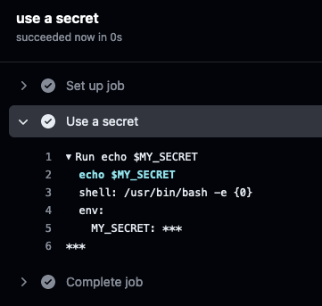
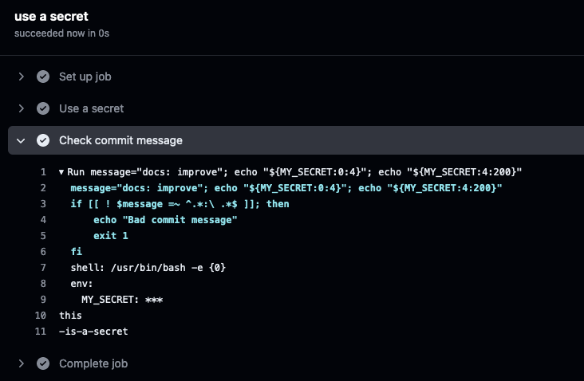

# Best practices & security considerations

This document provides an overview of best practices for writing and maintaining GitHub Actions. For the full detailed security hardening guide, see the [GitHub Actions Security Hardening Guide](https://docs.github.com/en/actions/security-guides/security-hardening-for-github-actions).

## Using secrets

Always use secrets for sensitive data such as API keys, passwords and tokens. Never hardcode secrets into workflow files. Secrets are encrypted and stored in GitHub, and are never printed in the logs. However, secrets can be transformed in various ways and somehow exposed in the logs (see example in chapter [Example with inline script](#example-with-inline-script)).

Documentation on how to use secrets in GitHub Actions can be found [here](https://docs.github.com/en/actions/security-guides/using-secrets-in-github-actions).

Example of using a secret in a workflow:

```yaml
jobs:
  test-job:
    name: use a secret
    runs-on: ubuntu-latest
    steps:
    - name: Use a secret
      env:
        MY_SECRET: ${{ secrets.MY_SECRET }}
      run: echo $MY_SECRET
```



## Permissions & responsibilities

### GITHUB TOKEN

TODO

### `pull_request` vs `pull_request_target`

TODO 

### Checkout action

TODO: document `persist-credentials: false`

### Preventing GitHub Actions from creating or approving pull requests

To prevent a workflow from merging a pull request without human review, you can disable this in the repository settings. Go to the `Actions` tab in the repository settings and uncheck the `Allow GitHub Actions to create and approve pull requests` option.

### Using CODEOWNERS file

The `CODEOWNERS` file defines the individuals or teams responsible for the code in a repository. The file is used to automatically request reviews from the code owners when a pull request changes any of their files. The syntax of the file is described [here](https://docs.github.com/en/repositories/managing-your-repositorys-settings-and-features/customizing-your-repository/about-code-owners).

### Configure private vulnerability reporting

To provide a secure way of reporting vulnerabilities, you can enable private vulnerability reporting. This allows security researchers to report vulnerabilities privately to the maintainers of the repository without disclosing them to the public.

Private vulnerability reporting can be enabled in the repository settings. (see [GitHub documentation](https://docs.github.com/en/code-security/security-advisories/working-with-repository-security-advisories/configuring-private-vulnerability-reporting-for-a-repository#enabling-or-disabling-private-vulnerability-reporting-for-a-repository))

## GitHub Action Best Practices

### Prevent script injection

A GitHub Actions workflow can be triggered by specific events such as push, pull request, new release, and so on. Each workflow trigger provides a [Github context](https://docs.github.com/en/actions/learn-github-actions/contexts#github-context) which contains information about the event. This can be the branch name, username, user email, pull request title and body, etc. All this input should be treated as potentially untrusted data, and make sure it doesn't flow into shell or API calls where it can be interpreted as code.

#### Example of a script injectinop attack with inline script

GitHub Actions support their own [expression syntax](https://docs.github.com/en/actions/learn-github-actions/contexts), which can be used to access the context data. The following example shows how to access the commit message from the context and check if it follows a certain pattern.

```yaml
jobs:
  test:
    name: use a secret
    runs-on: ubuntu-latest
    env:
      MY_SECRET: ${{ secrets.MY_SECRET }}
    steps:
    - name: Check commit message
      run: |
        message="${{ github.event.head_commit.message }}"
        if [[ ! $message =~ ^.*:\ .*$ ]]; then
            echo "Bad commit message"
            exit 1
        fi
```

The problem with this approach is the `run` operation, which starts a temporary shell and executes the script. Before running the script, the GitHub context data (`${{ }}`) is parsed and replaced with the resulting values, making it vulnerable to shell command injection. If we use a commit message like `docs: improve"; echo "${MY_SECRET}`, the secret will be printed in the logs. Since GitHub secrets are not printed in the logs, we can use the following commit message to print the secret over two lines: `docs: improve"; echo "${MY_SECRET:0:4}"; echo "${MY_SECRET:4:200}`.



The value of the `MY_SECRET` secret will be printed in the logs (line 10-11)!

### Mitigating script injection attacks

The recommended way is to use an action instead of an inline script. There, the context value can be passed as an argument. 

```yaml
uses: fakeaction/checktitle@v3
with:
    title: ${{ github.event.pull_request.title }}
```

A simple workaround for the inline script is to use an intermediate environment variable. This way, the context value is not directly passed and evaluated directl in the shell.

```yaml
jobs:
  test:
    name: use a secret
    runs-on: ubuntu-latest
    env:
      MY_SECRET: ${{ secrets.MY_SECRET }}
    steps:
    - name: Check commit message (mitigate shell injection)
      env:
        MESSAGE: ${{ github.event.head_commit.message }}
      run: |
        if [[ ! $MESSAGE =~ ^.*:\ .*$ ]]; then
            echo "Bad commit message"
            exit 1
        fi
```


## Additional Workflows

### Using third-party actions

Third party actions can be a significant security risk. A job may have access to repository secrets, may have access to a directory shared by other jobs, or may be able to use the `GITHUB_TOKEN` to write to the repository. Always check the source code of the action and the permissions it requires. It is recommended to **pin actions to a full-length commit SHA** rather than just a tag. In the GitHub Marketplace, you can see a "verified creator" badge, which indicates that the action was written by a team whose identity has been verified by GitHub.

You can use Dependabot to keep your actions up to date. Dependabot will automatically create pull requests to update your actions to the latest version.

### Using Dependabot

TODO: Add more information about Dependabot

### Using code scanning workflows 

To automatically scan your code for potential vulnerabilities, it's recommended that you use code scanning workflows. You can use [CodeQL](https://github.com/github/codeql) from GitHub or other third-party tools. CodeQL is an analysis engine that allows you to write queries to find vulnerabilities in your code. You can use the standard CodeQL queries written by GitHub researchers and community members, or write your own queries.

**Using CodeQL**

To enable CodeQL scanning, you need to add a workflow file to your repository. You can easily create the workflow in your repository settings.

Go to the `Code security and analysis` tab in the repository settings and click 'Set up' in the `Code scanning` section.


If you choose `Advanced`, you can edit the workflow file and customize it to your needs.


After committing the workflow file, the code scanning will start automatically. You can see the results in the `Code scanning alerts` tab.

ℹ️ See the [CodeQL Workflow Example](../.github/workflows/codeql.yaml) in this repository.

## OpenSSF Scorecards

The [OpenSSF Scorecards](https://github.com/ossf/scorecard) helps source maintainers improve their security best practices by providing checks related to software security and assigning a score for each check and the overall project. The scorecard can be integrated into a GitHub Actions workflow. The goal is to automate analysis and trust decisions about the security posture of open source projects.

After activating the scorecard workflow, the results are uploaded to the repository's security tab. The results are in the [SARIF](https://docs.github.com/en/code-security/code-scanning/integrating-with-code-scanning/sarif-support-for-code-scanning) format, which can be viewed in the GitHub UI.


ℹ️ See the [OpenSSF Workflow Example](../.github/workflows/scorecard.yaml) in this repository.

### Additional checks

## OpenSSF Best Practices Badge

The [Open Source Security Foundation (OpenSSF)](https://openssf.org/) provides a badge that indicates a project's security best practices score. The badge is generated based on the [OpenSSF Best Practices](https://www.bestpractices.dev/en/criteria/0) criteria. To get the badge, you need to register at the [OpenSSF Best Practices](https://www.bestpractices.dev/en) website and submit your repository. You will then need to answer a questionnaire about the project's security practices. The badge is generated based on the answers and is available once you have started answering the questionnaire. The badge can then be added to the repository's README file.

---

# Sources and further reading

**GitHub documentation**

- [Security hardening for GitHub Actions](https://docs.github.com/en/actions/security-guides/security-hardening-for-github-actions)
- [Using secrets in GitHub Actions](https://docs.github.com/en/actions/security-guides/using-secrets-in-github-actions)
- [Using GitHub's security features to secure your use of GitHub Actions](https://docs.github.com/en/actions/security-guides/using-githubs-security-features-to-secure-your-use-of-github-actions)
- [Automatic token authentication](https://docs.github.com/en/actions/security-guides/automatic-token-authentication) (`GITHUB_TOKEN`)
- [SARIF support for code scanning](https://docs.github.com/en/code-security/code-scanning/integrating-with-code-scanning/sarif-support-for-code-scanning)

**Blogs**

- Keeping your GitHub Actions and workflows secure
  - [Part 1: Preventing pwn requests](https://securitylab.github.com/research/github-actions-preventing-pwn-requests/)
  - [Part 2: Untrusted input](https://securitylab.github.com/research/github-actions-untrusted-input/)
  - [Part 3: How to trust your building blocks](https://securitylab.github.com/research/github-actions-building-blocks/)

**Scorecard**

- [Getting Started with Scorecard Checks for Supply Chain Security](https://github.com/ossf/scorecard/blob/main/docs/beginner-checks.md)
- [Check Documentation](https://github.com/ossf/scorecard/blob/main/docs/checks.md)
- [Scorecards' GitHub action](https://github.com/ossf/scorecard-action)

**OpenSSF Best Practices**

- [Sign Up](https://www.bestpractices.dev/en)
- [Criterias](https://www.bestpractices.dev/en/criteria/0)
