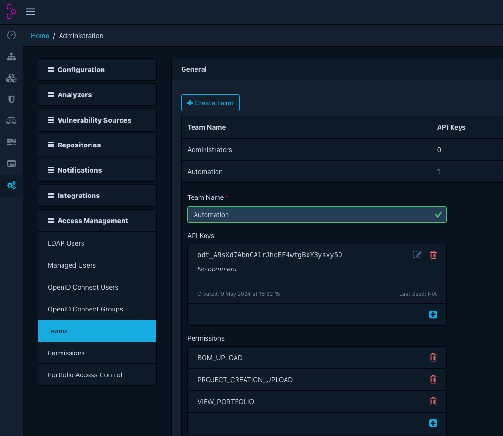
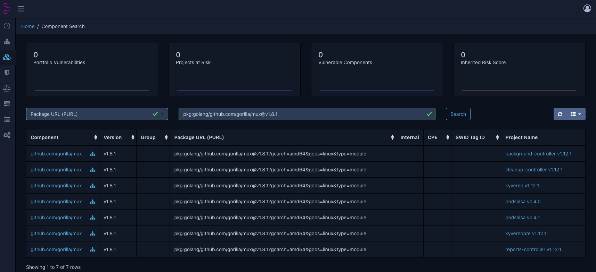
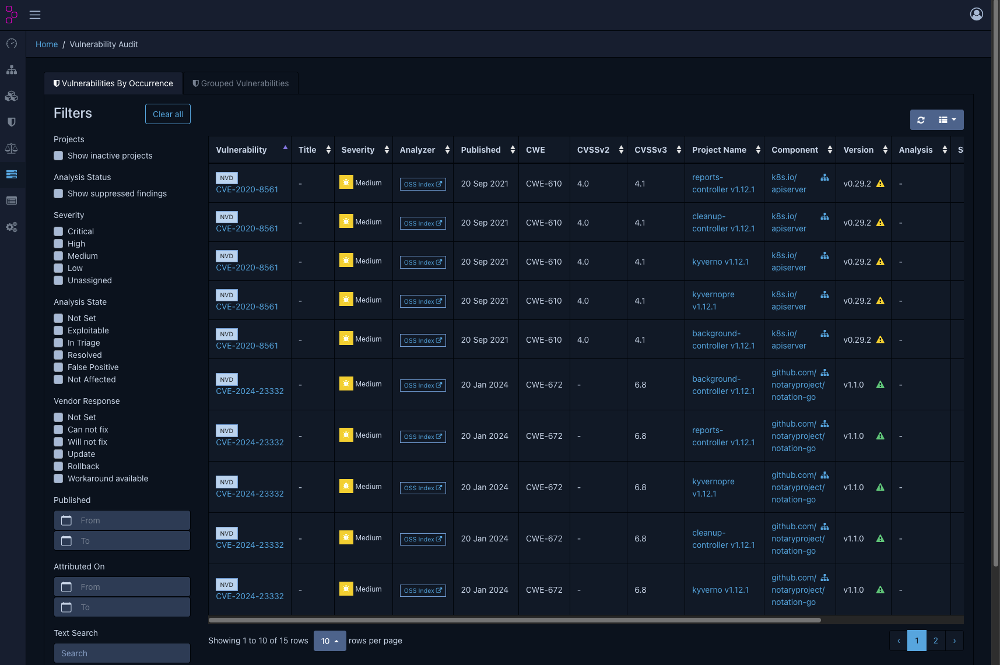
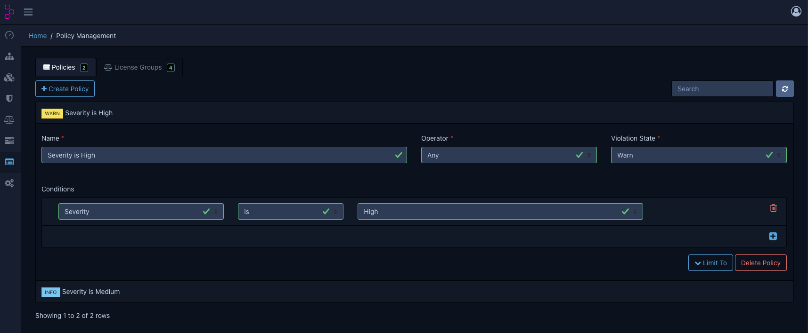

# Dependency-Track

## Overview

[Dependency-Track](https://dependencytrack.org/) is an intelligent component analysis platform that enables organizations to identify and reduce risk in the software supply chain. Dependency-Track monitors component usage across all versions of each application in the portfolio to proactively identify risk across the organisation. The platform has an API-first design and is ideal for use in CI/CD environments.

## Install Dependency-Track locally

```bash
curl -LO https://dependencytrack.org/docker-compose.yml

docker-compose up -d
```

This will start following containers:
- `apiserver`: The Dependency-Track API server
- `frontend`: The Dependency-Track frontend

Go to [http://localhost:8080](http://localhost:8080) and login with the default credentials `admin`/`admin`.

## Create API-Key

Create a new API key for the `Automation` team in the `Configuration/Access Management/Teams` section. You mus add the `PROJECT_CREATION_UPLOAD` permission to the team. Export the API key as an environment variable.



```bash
export API_TOKEN=xxx
```
## Upload SBOMs

You can either import SBOMs manually via the frontend or via the API.
The manual import is described in the [manual SBOM import](manual-sbom-import.md) section.

Another way to import all SBOMs automatically is to use the [sbom-operator](sbom-operator.md). This only applies to SBOMs from container images running in a Kubernetes cluster.

## Search for components

You can search for components in the "Component Search" section. You can search for a Package URL (PURL), CPE, SWID Tag ID, Hash and more.

An example search for the PURL `pkg:golang/github.com/gorilla/mux@v1.8.1`:



## Vulnerability Audit

In the "Vulnerability Audit" section, you can see all vulnerabilities of the components in the projects. You can filter by severity, status, and more.



## Policy Management

In the "Policy Management" section, you can create and enforce security, operational and license policies. You can create a new policy and add conditions to it.

For example you can create a policy that checks if the component has a vulnerability with a severity of `HIGH` and create notifications for it. There are several notification channels available like Slack, Email, Webhook, etc.



## Further steps

After importing some SBOMs in Dependency-Track, you can see the vulnerability count and a risk score in the Dashboard.

There are many more features in Dependency-Track which you can explore. Some ideas for further steps are to add the GitHub Advisory vulnerability source, create notifications for new vulnerabilities and implement Dependency-Track in your CI/CD pipeline.

## Cleanup

To stop the containers, run:

```bash
docker-compose down
```
