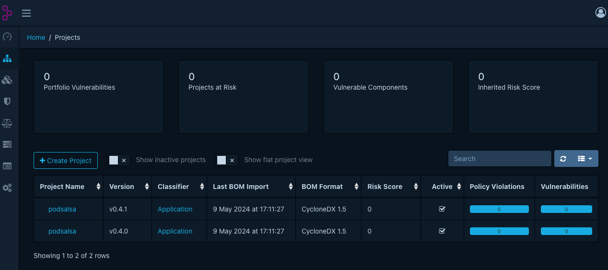
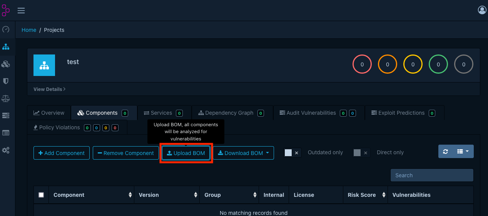

# Dependency-Track: Manual SBOM Import

There are several ways to distribute SBOMs. One way is to upload the SBOMs to an OCI-Registry without provenance. Another, recommended but newer way, is to create provenance for the SBOMs and upload them as attestations to the OCI-Registry. In this way, the integrity and authenticity of the SBOMs can be verified. The last way is to upload the SBOMs manually via the frontend.

**Important**

You must have set the `API_TOKEN` environment variable to upload SBOMs via the API. 

## Create SBOM from container image

If a SBOM is not available, you can create one with [syft](https://github.com/anchore/syft). To install `syft`, have a look at the [documentation](https://github.com/anchore/syft?tab=readme-ov-file#installation).

The following example shows how to create a SBOM for the `grafana` container image.

```bash
syft scan grafana/grafana:latest -o cyclonedx-json > grafana.sbom
```

This SBOM can now be uploaded to the Dependency-Track.

```bash
export HOST=http://localhost:8081

curl -X "POST" "$HOST/api/v1/bom" \
    -H 'Content-Type: multipart/form-data' \
    -H "X-API-Key: $API_TOKEN" \
    -F "autoCreate=true" \
    -F "projectName=grafana" \
    -F "projectVersion=latest" \
    -F "bom=@grafana.sbom"
```

## Import SBOMs via API (with provenance)

The following example shows how to download and verify the SBOMs of the `podsalsa` project and import them into the dependency-track.

```bash
mkdir sboms
cd sboms

# get the latest release version
export VERSION=$(curl -s "https://api.github.com/repos/janfuhrer/podsalsa/releases/latest" | jq -r '.tag_name')

# download sbom of container image
IMAGE=ghcr.io/janfuhrer/podsalsa:$VERSION
IMAGE="${IMAGE}@"$(crane digest "${IMAGE}")

COSIGN_REPOSITORY=ghcr.io/janfuhrer/sbom cosign verify-attestation \
  --type cyclonedx \
  --certificate-oidc-issuer https://token.actions.githubusercontent.com \
  --certificate-identity-regexp '^https://github.com/janfuhrer/podsalsa/.github/workflows/release.yml@refs/tags/v[0-9]+.[0-9]+.[0-9]+(-rc.[0-9]+)?$' \
  $IMAGE | jq -r '.payload' | base64 -d | jq -r '.predicate' > podsalsa-$VERSION.sbom
```

If we do this for multiple versions, we can upload them in a loop:

```bash
export HOST=http://localhost:8081

for ARTIFACT in *.sbom; do \
    echo -e "\n--Uploading $ARTIFACT"; \
    PROJECT_VERSION="$(echo $ARTIFACT | sed -n 's/^.*-\(v[0-9]*\.[0-9]*\.[0-9]*\)\.sbom$/\1/p')" && \
    PROJECT_NAME="$(echo $ARTIFACT | sed -n 's/\(.*\)-v[0-9]*\.[0-9]*\.[0-9]*.sbom$/\1/p')" && \
    curl -X "POST" "$HOST/api/v1/bom" \
    -H 'Content-Type: multipart/form-data' \
    -H "X-API-Key: $API_TOKEN" \
    -F "autoCreate=true" \
    -F "projectName=$PROJECT_NAME" \
    -F "projectVersion=$PROJECT_VERSION" \
    -F "bom=@$ARTIFACT" \
    ; done
```

Example output:

```bash
--Uploading podsalsa-v0.4.0.sbom
{"token":"xxx"}
--Uploading podsalsa-v0.4.1.sbom
{"token":"xxx"}
```

The uploaded SBOMs are now accessible in the "Projects" section:



## Import SBOMs via API (without provenance)

There is a deprecated method to upload SBOMs to an OCI registry with `cosign attach`. Theses SBOMs are not signed but can be downloaded with `cosign download sbom`. The following example shows how to download the SBOMs of the Kyverno project.

```bash
# kyverno version
export VERSION=v1.12.1

# image array
IMAGES=(
  ghcr.io/kyverno/background-controller:$VERSION
  ghcr.io/kyverno/cleanup-controller:$VERSION
  ghcr.io/kyverno/kyverno:$VERSION
  ghcr.io/kyverno/kyvernopre:$VERSION
  ghcr.io/kyverno/reports-controller:$VERSION
)

# download sbom of container image
for IMAGE in "${IMAGES[@]}"; do
  NAME=$(echo "${IMAGE##*/}" | cut -d':' -f1) && \
  COSIGN_REPOSITORY=ghcr.io/kyverno/sbom cosign download sbom \
  $IMAGE > $NAME-$VERSION.sbom \
  ; done
```

We can now loop the SBOMs back into the dependency track: 

```bash
# upload sbom to dependency-track
export HOST=http://localhost:8081

for ARTIFACT in *.sbom; do \
    echo -e "\n--Uploading $ARTIFACT"; \
    PROJECT_VERSION="$(echo $ARTIFACT | sed -n 's/^.*-\(v[0-9]*\.[0-9]*\.[0-9]*\)\.sbom$/\1/p')" && \
    PROJECT_NAME="$(echo $ARTIFACT | sed -n 's/\(.*\)-v[0-9]*\.[0-9]*\.[0-9]*.sbom$/\1/p')" && \
    curl -X "POST" "$HOST/api/v1/bom" \
    -H 'Content-Type: multipart/form-data' \
    -H "X-API-Key: $API_TOKEN" \
    -F "autoCreate=true" \
    -F "projectName=$PROJECT_NAME" \
    -F "projectVersion=$PROJECT_VERSION" \
    -F "bom=@$ARTIFACT" \
    ; done
```

## Import SBOMs manually

You can also import the SBOMs manually via the frontend. Go to the "Projects" section and click on "Create Project". Fill in the project name and version and click on "Create". Then click on "Upload BOM" in the "Components" section and select the SBOM file.


