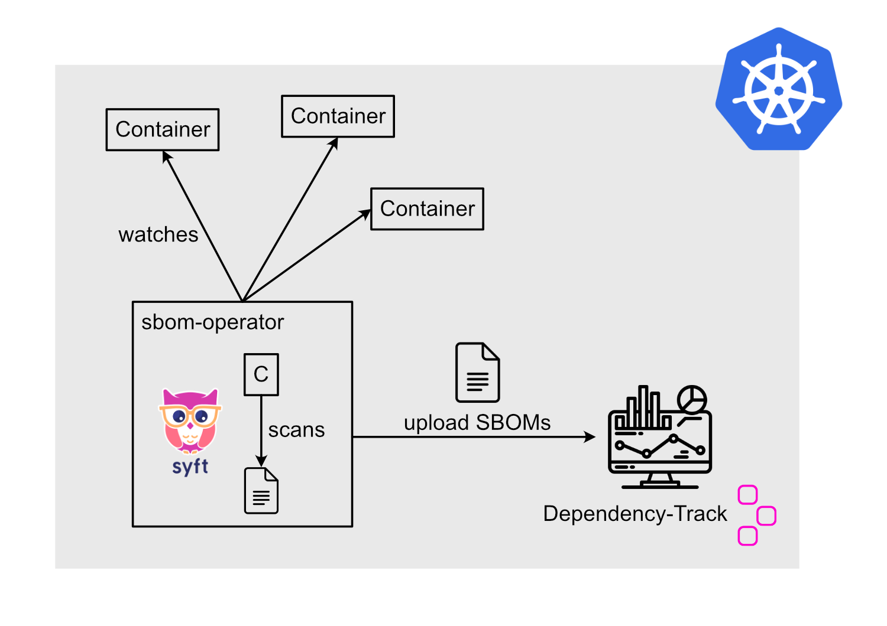

# sbom-operator

The [sbom-operator](https://github.com/ckotzbauer/sbom-operator) watches for new pods in the cluster and extracts the container image names. It then uses [Syft](https://github.com/anchore/syft) to create an SBOM for each container. All SBOMs are then uploaded to Dependency-Track and scanned for vulnerabilities. With this solution, it is possible to have an overview of all components used in a Kubernetes cluster and monitor them for vulnerabilities.

The deployment of the sbom-operator is described in the [deployment](deployment/) section.

An overview of the components is shown in the following picture:

