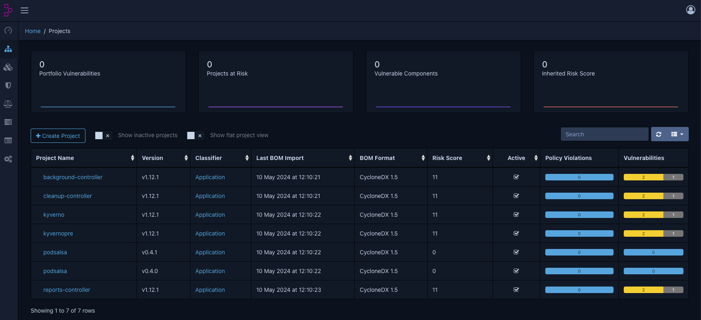
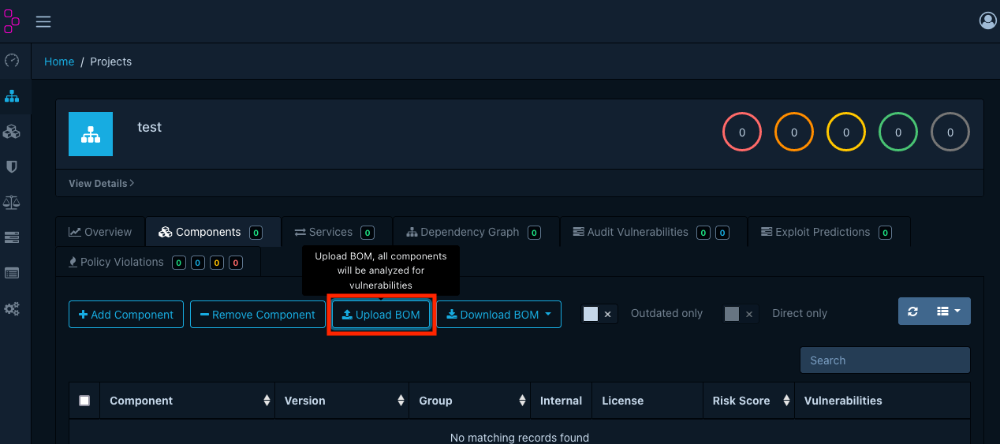

# Dependency-Track

## Overview

[Dependency-Track](https://dependencytrack.org/) is an intelligent component analysis platform that enables organizations to identify and reduce risk in the software supply chain. Dependency-Track monitors component usage across all versions of each application in the portfolio to proactively identify risk across the organisation. The platform has an API-first design and is ideal for use in CI/CD environments.

## Install Dependency-Track locally

```bash
curl -LO https://dependencytrack.org/docker-compose.yml

docker-compose up -d
```

This will start following containers:
- `apiserver`: The Dependency-Track API server
- `frontend`: The Dependency-Track frontend

Go to [http://localhost:8080](http://localhost:8080) and login with the default credentials `admin`/`admin`.

## Create API-Key

Create a new API key for the `Automation` team in the `Configuration/Access Management/Teams` section. You mus add the `PROJECT_CREATION_UPLOAD` permission to the team. Export the API key as an environment variable.


```bash
export API_TOKEN=xxx
```

## Import SBOMs via API

First, we need to download the SBOMs of a project and import them into the apiserver. The following example shows how to download the SBOMs of the `janfuhrer/podsalsa` project and import them into the dependency-track.

```bash
mkdir sboms
cd sboms

# get the latest release version
export VERSION=$(curl -s "https://api.github.com/repos/janfuhrer/podsalsa/releases/latest" | jq -r '.tag_name')

# download sbom of container image
IMAGE=ghcr.io/janfuhrer/podsalsa:$VERSION
IMAGE="${IMAGE}@"$(crane digest "${IMAGE}")

COSIGN_REPOSITORY=ghcr.io/janfuhrer/sbom cosign verify-attestation \
  --type cyclonedx \
  --certificate-oidc-issuer https://token.actions.githubusercontent.com \
  --certificate-identity-regexp '^https://github.com/janfuhrer/podsalsa/.github/workflows/release.yml@refs/tags/v[0-9]+.[0-9]+.[0-9]+(-rc.[0-9]+)?$' \
  $IMAGE | jq -r '.payload' | base64 -d | jq -r '.predicate' > podsalsa-$VERSION.sbom
```

There is a bug in the Dependency-Track API that does not allow to upload a SBOM which has not the specific format (`specVersion` must be after `bomFormat`). To fix this, we need to restructure the json of the container SBOM.

```bash
jq '{ "$schema", "bomFormat", "specVersion", components, dependencies, metadata, serialNumber, version }' podsalsa-$VERSION.sbom > podsalsa-$VERSION-new.sbom
rm podsalsa-$VERSION.sbom
```

If we do this for multiple versions, we can upload them in a loop:

```bash
for ARTIFACT in *.sbom; do \
    echo -e "\n--Uploading $ARTIFACT"; \
    VERSION="$(echo $ARTIFACT | sed -n 's/^.*-\(v[0-9]*\.[0-9]*\.[0-9]*\)-.*\.sbom$/\1/p')" && \
    curl -X "POST" "http://localhost:8081/api/v1/bom" \
    -H 'Content-Type: multipart/form-data' \
    -H "X-API-Key: $API_TOKEN" \
    -F "autoCreate=true" \
    -F "projectName=podsalsa" \
    -F "projectVersion=$VERSION" \
    -F "bom=@$ARTIFACT" \
    ; done
```

Example output:

```bash
--Uploading podsalsa-v0.4.0-new.sbom
{"token":"xxx"}
--Uploading podsalsa-v0.4.1-new.sbom
{"token":"xxx"}
```

The uploaded SBOMs are now accessible in the "Projects" section:



## Import SBOMs manually

You can also import the SBOMs manually via the frontend. Go to the "Projects" section and click on "Create Project". Fill in the project name and version and click on "Create". Then click on "Upload BOM" in the "Components" section and select the SBOM file.



## Further steps

After importing some SBOMs either via API or manually, you can see vulnerabilites and a risk score in the Dashboard.

There are many more features in Dependency-Track which you can explore:

- Vulnerability Detection: add more sources for vulnerability detection like GitHub Advisory, Google OSV Advisory, VulnDB, Snyk, Trivy, etc.
- Create and enforce security, operational and license policies
- Configure notifications
