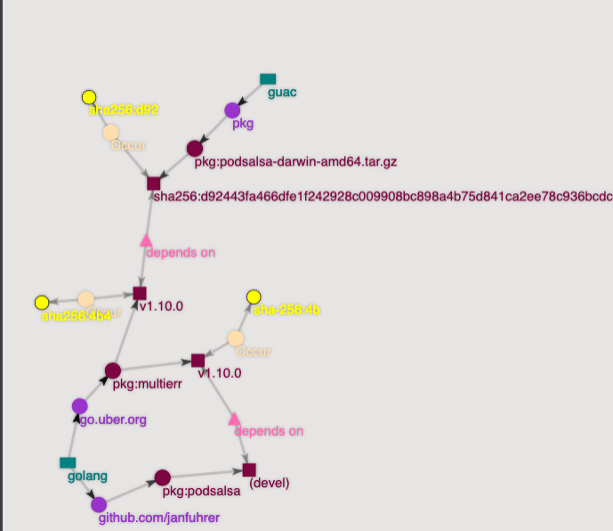

# GUAC

## Overview

[GUAC](https://github.com/guacsec/guac) stands for "Graph for Understanding Artifact Composition" and is a tool to analyze and visualize software dependencies. GUAC ingest software security metadata, such as SBOMs, and maps the relationships between software. The [GUAC Visualizer](https://docs.guac.sh/guac-visualizer/) can use to explore the various nodes and relationships. 

GUAC further implements [deps.dev](https://deps.dev) for source location, [OpenSSF Scorecards](https://securityscorecards.dev/) results and vulnerability data from [OSV.dev](https://osv.dev/) to combine all available data in one place.

GUAC supports [CycloneDX](https://cyclonedx.org/) and [SPDX](https://spdx.dev/) SBOM formats.

The `guacone` CLI is used to interact with the GUAC server (load SBOMs, mark packages as vulnerable, etc.).

For more information, see the [GUAC Docs](https://docs.guac.sh/).

## Install GUAC locally

See the [installation guide](./install-guac-locally.md) to install GUAC locally.

## Import SBOMs

First, we need to download the SBOMs of a project and import them into GUAC. The following example shows how to download the SBOMs of the `janfuhrer/podsalsa` project and import them into GUAC.

```bash
mkdir sboms
cd sboms

# import podsalsa sboms for the latest release
export VERSION=$(curl -s "https://api.github.com/repos/janfuhrer/podsalsa/releases/latest" | jq -r '.tag_name')
for ARTIFACT in $(curl -s "https://api.github.com/repos/janfuhrer/podsalsa/releases/latest" | jq -r '.assets[] | select(.name | endswith(".sbom")) | .name'); do curl -L -O -s https://github.com/janfuhrer/podsalsa/releases/download/$VERSION/$ARTIFACT; done

# download all available sboms of janfuhrer/podsalsa/sbom
for SBOM_TAG in $(crane ls ghcr.io/janfuhrer/sbom); do crane export ghcr.io/janfuhrer/sbom:$SBOM_TAG ./$SBOM_TAG; done
```

Import all SBOMs to guac:

```bash
guacone collect files sboms/
```

## Mark a package as vulnerable

Vulnerabilities are scanned against the [OSV](https://osv.dev/) database. To mark a package manually as vulnerable (e.g. in case of a zero day), use the following command:

```bash
# mark a package as vulnerable
guacone certify package -n "Zero Day" "pkg:golang/go.uber.org/multierr"
```

We now can query the affected packages:

```bash
guacone query bad
# select the created "Zero Day" vulnerability
```

This returns a "Visualizer url" which can be opened in a browser to see the affected packages in the `guac-visualizer` running on `localhost:8080`.



More information can be found in the [GUAC Docs](https://docs.guac.sh/).
