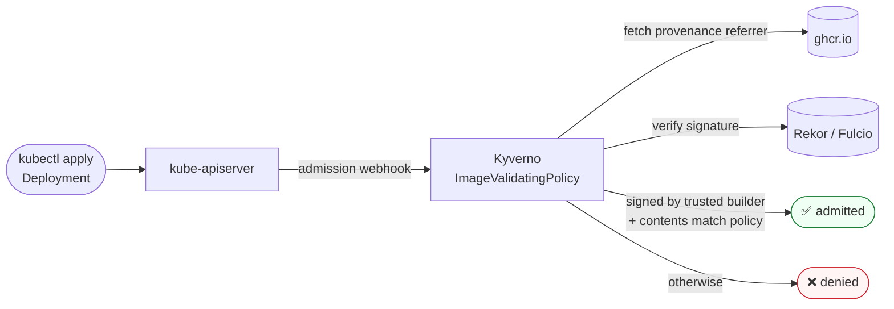

# Kubernetes enforcement with Kyverno

[Kyverno](https://kyverno.io/) can reject images at admission time unless they carry valid SLSA
provenance from the trusted builder. This example demonstrates that on a local
[kind](https://kind.sigs.k8s.io/) cluster.



> [!IMPORTANT]
> The policies verify **SLSA v1** provenance produced by GitHub Artifact Attestations, and pin the
> trusted builder `build-image.yml`. They therefore match images from **v0.10.0 onwards**.
> Releases up to v0.9.x carry SLSA v0.2 provenance from the `slsa-github-generator` and are
> rejected — verify those with [the legacy instructions](../../../archive/verification-legacy.md).
>
> Requires **Kyverno 1.19.0 or newer**.

## Which policy to use

| Policy | API | Status |
| :--- | :--- | :--- |
| [imagevalidatingpolicy-slsa.yaml](./kyverno/imagevalidatingpolicy-slsa.yaml) | `policies.kyverno.io/v1` | **Recommended.** The current API |
| [clusterpolicy-slsa.yaml](./kyverno/clusterpolicy-slsa.yaml) | `kyverno.io/v1` | Legacy. `ClusterPolicy` is deprecated as of Kyverno 1.19 and will be removed |

Both express the same checks. Applying the legacy one prints:

```
Warning: kyverno.io/v1 ClusterPolicy is deprecated and will be removed in a future release;
migrate to ValidatingPolicy, MutatingPolicy, GeneratingPolicy or ImageValidatingPolicy
```

One difference matters if you adapt them. In `ImageValidatingPolicy`, `extractPayload()` returns
the in-toto **statement**, so fields are addressed below `.predicate`. In the legacy
`ClusterPolicy`, `conditions` are rooted at the **predicate** itself, so the same field is
`buildDefinition.buildType` rather than `predicate.buildDefinition.buildType`.

## Install local kind cluster

```bash
brew install kind
kind create cluster
```

## Install Kyverno

```bash
helm repo add kyverno https://kyverno.github.io/kyverno/
helm repo update
helm install kyverno kyverno/kyverno -n kyverno --create-namespace --wait

kubectl get pods -n kyverno
```

## Deploy the policy

```bash
kubectl apply -f https://raw.githubusercontent.com/janfuhrer/podsalsa/main/docs/slsa/enforcement-kubernetes/kyverno/imagevalidatingpolicy-slsa.yaml

# confirm it is ready
kubectl get ivpol
```

```
NAME                             AGE   READY
verify-slsa-provenance-keyless   9s    true
```

## A verified image is admitted

```bash
kubectl apply -f https://raw.githubusercontent.com/janfuhrer/podsalsa/main/docs/slsa/enforcement-kubernetes/deployment.yaml

deployment.apps/podsalsa created
```

```bash
kubectl get pods

NAME                        STATUS    IMAGE
podsalsa-77c9f96c8d-z98ds   Running   ghcr.io/janfuhrer/podsalsa:v0.10.0@sha256:65606217...
```

## An unverified image is denied

Version `v0.1.0` was released before provenance existed, so it has none:

```bash
kubectl apply -f https://raw.githubusercontent.com/janfuhrer/podsalsa/main/docs/slsa/enforcement-kubernetes/deployment-fail.yaml

Error from server: error when creating "deployment-fail.yaml": admission webhook
"ivpol.validate.kyverno.svc-fail-finegrained-verify-slsa-provenance-keyless" denied the request:
Policy verify-slsa-provenance-keyless failed: SLSA provenance is not signed by the trusted
builder (.github/workflows/build-image.yml at a version tag).
```

To convince yourself the check is real rather than a rubber stamp, change `build-image.yml` to
`release.yml` in the policy's `subjectRegExp` and re-apply it. The *valid* image is then denied
too, because `release.yml` only calls the builder — it never signs.

## Cleanup

```bash
kind delete cluster
```

## Alternative: Sigstore Policy Controller

Kyverno is not GitHub's own recommendation for enforcing artifact attestations — that is the
[Sigstore Policy Controller](https://docs.github.com/en/actions/how-tos/secure-your-work/use-artifact-attestations/enforce-artifact-attestations),
for which GitHub publishes a ready-made `ClusterImagePolicy` and trust root. An example
configuration is kept in [archive/policy-controller](../../../archive/policy-controller/).
We use Kyverno here because it is not limited to SLSA verification.
