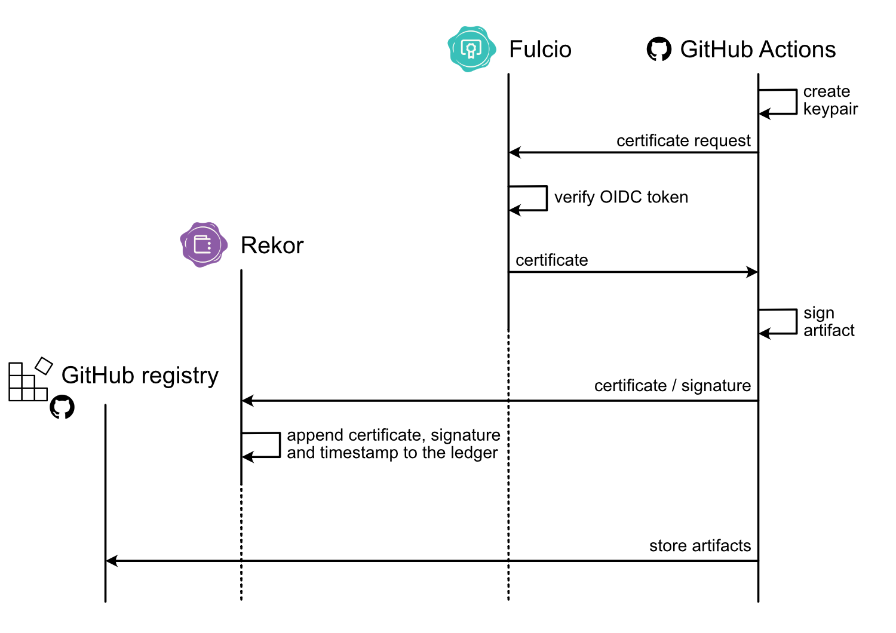
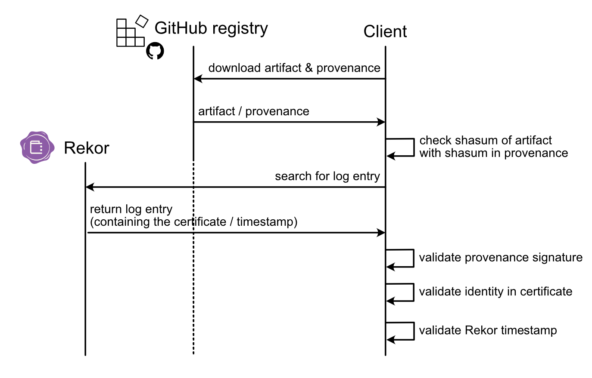
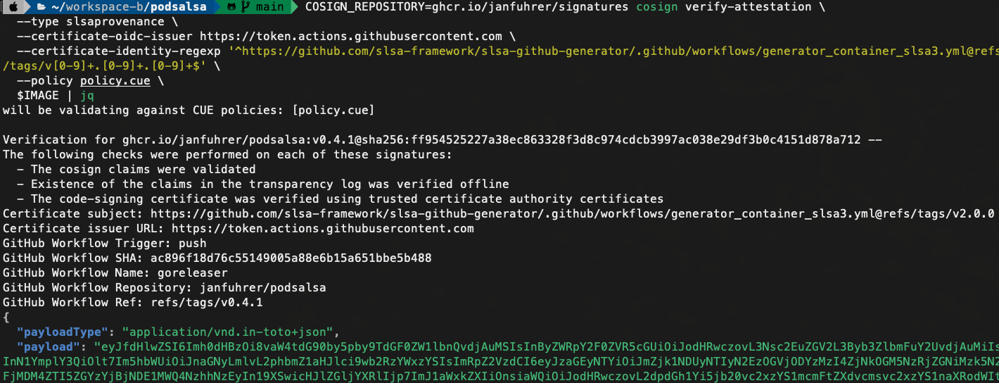
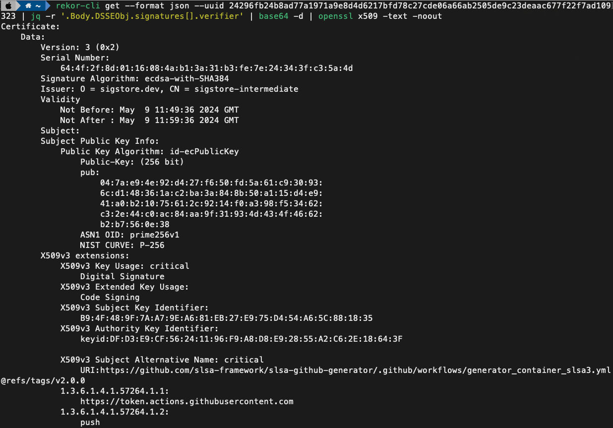

# Sigstore

The [Sigstore project](https://www.sigstore.dev/) was founded in 2021 to create a new standard for signing and verifying open source software. It provides a set of tools for signing and verifying artifacts, and storing the signatures in a public transparency log. It is backed by the Open Source Security Foundation (OpenSSF) under the Linux Foundation.

The following are the major components of the Sigstore project:

- **[Rekor](https://github.com/sigstore/rekor)**: An immutable, tamper-resistant ledger of metadata that acts as a transparency log for storing signatures.
- **[Cosign](https://github.com/sigstore/cosign)**: A tool for signing and verifying artifacts and containers.
- **[Fulcio](https://github.com/sigstore/fulcio)**: A free-to-use certification authority for code signing certificates.

**Sigstore Trust Root**

Sigstore's trust model originates from the Trust Root and chains down to the short-lived certificates issued by Fulcio. The Trust Root was established during a public root key signing ceremony ([link](https://www.youtube.com/watch?v=GEuFsc8Zm9U)) in 2021.

## Signing

The Sigstore project allows keyless signing using OIDC. Keyless means that no private key is stored on the client side and the signing process is done using ephemeral keys.
The following picture shows how this is done using GitHub as the OIDC provider and Fulcio as the certificate authority.

1. The Sigstore client in the GitHub Action generates an ephemeral public/private keypair in memory. It binds the public key to a short-lived certificate request and sends it to Fulcio. The request includes an OIDC token from GitHub that contains information about the user and the repository.
2. Fulcio verifies this token and issues the short-lived certificate.
3. The client signs the artifact (e.g. container image or provenance file) with the ephemeral private key while the certificate is still valid.
4. The client sends the signature and certificate to Rekor as proof that the artifact was signed while the certificate was valid. If a signature is stored in the log, the corresponding entry is added to the log with a signed timestamp.
5. The artifacts (e.g., signed container images, signed provenance and binaries) are stored in the GitHub container/package registry.

The ephemeral key exists only in memory, the private key is never stored and is never known to Sigstore.

Since all certificates are stored by Fulcio in Rekor, a mis-issued certificate (e.g. OIDC compromise) can be detected. This must be done by the user, as Fulcio itself does not monitor the transparency log.

## Verification

To verify, a Sigstore client downloads the artifact and provenance (e.g., go binary and signed provenance) or a signed artifact (e.g., signed container image) and obtains the corresponding certificate from Rekor. The client then verifies the signature on the artifact/provenance using the public key from the certificate, confirms that the identity in the certificate matches the expected identity, validates the certificate against the Sigstore root of trust, and confirms the proof of inclusion in Rekor. If all these details are verified, the user can be sure that the artifact came from the intended source and hasn't been tampered with since its creation. The following picture illustrates the simplified process of verifying an artifact with provenance.

The whole verification process is automated and can be done with the Sigstore `cosign` or the `slsa-verifier` tool.

## Examples

The verification process is documented in the [SECURITY.md](../../../SECURITY.md#release-verification) file.

A sample output of the verification process is shown in the following example:

It is also possible to extract the short-lived certificate from the Rekor log entry (see the [rekor documentation](./rekor.md) on how to do this). Sigstore uses custom OIDs to store information about the certificate. The OIDs are defined in the [Fulcio docs](https://github.com/sigstore/fulcio/blob/main/docs/oid-info.md). The following picture shows the certificate of an attestation.

